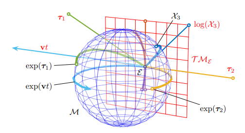
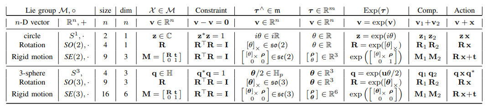
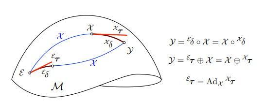
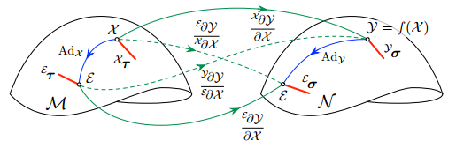
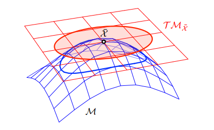
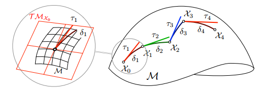

# Lie Group

李群和李代数的关系如下图就能看出.

红色平面是李群的流形$\mathcal{M}$在$\varepsilon$的切线空间$\mathcal{T} \mathcal{M}_{\mathcal{E}}$.每个在红色平面的通过原点的直线路径$v t$在流形上都能产生一条线$\exp (\mathbf{v} t)$.

### The Lie Group

一个群$(\mathcal{G}, \circ)$可以表示为一个集合$\mathcal{G}$和一个符号运算$\circ$.对于元素$\mathcal{X}, \mathcal{Y}, \mathcal{Z} \in \mathcal{G}$满足以下几个定理:
$$
\begin{array}{l}{\mathcal{X} \circ \mathcal{Y} \in \mathcal{G}} \\ {\mathcal{E} \circ \mathcal{X}=\mathcal{X} \circ \mathcal{E}=\mathcal{X}} \\ {\mathcal{X}^{-1} \circ \mathcal{X}=\mathcal{X} \circ \mathcal{X}^{-1}=\mathcal{E}} \\ {(\mathcal{X} \circ \mathcal{Y}) \circ \mathcal{Z}=\mathcal{X} \circ(\mathcal{Y} \circ \mathcal{Z})}\end{array}
$$

### The Group Action

李群$\mathcal{M}$可以通过符号运算$\circ$改变其他的集合$\mathcal{V}$上的元素到这个集合上的另一个元素($\mathcal{X} \in \mathcal{M}$ on $v \in \mathcal{V}$):
$$
\mathcal{M} \times \mathcal{V} \rightarrow \mathcal{V} ;(\mathcal{X}, v) \mapsto \mathcal{X} \cdot v
$$
比如以下几个例子:
$$
\begin{array}{lll}{S O(n) : \text { rotation matrix }} & {\mathbf{R} \cdot \mathbf{x} \triangleq \mathbf{R} \mathbf{x}} \\ {S E(n) : \text { Euclidean matrix }} & {\mathbf{H} \cdot \mathbf{x} \triangleq \mathbf{R} \mathbf{x}+\mathbf{t}} \\ {S^{1} : \text { unit complex }} & {\mathbf{z} \cdot \mathbf{x} \triangleq \mathbf{z} \mathbf{x}} \\ {S^{3} : \text { unit quaternion }} & {\mathbf{q} \cdot \mathbf{x} \triangleq \mathbf{q} \mathbf{x} \mathbf{q}^{*}}\end{array}
$$

### 切线空间和李代数

对于在李群流形$\mathcal{M}$上的点$\mathcal{X}(t)$,它的速度$\dot{\mathcal{X}}=\partial \mathcal{X} / \partial t$在李群流形$\mathcal{M}$在$\mathcal{X}$的切线空间上,我们定义它为$\mathcal{T M}_{\mathcal{X}}$.在每个点上都没有尖峰或边缘,则意味着每一个点都存在独特的切线空间.

1. 李代数$\mathrm{m}$:在原点的切线空间,$\mathcal{T} \mathcal{M}_{\mathcal{E}}$,我们叫它$\mathcal{M}$的李代数,标注为$\mathrm{m}$.

$$
\quad \mathfrak{m} \triangleq \mathcal{T} \mathcal{M}_{\mathcal{E}}
$$

每个李群都有一个相关联的李代数.有以下几个性质:

- 李代数是一个向量空间.这个向量在$\mathbb{R}^{m}$空间中,m是李群$\mathcal{M}$的自由度.
- 通过指数映射exp:$\mathfrak{m} \rightarrow \mathcal{M}$,便可将李代数上的元素转化为李群上的元素,log映射则是相反的操作.
- 在某点$\mathcal{X}$的切线空间可以通过线性变换转化到原点$\mathcal{E}$的线性空间上.这个变换叫做伴随矩阵.

在李代数中,有一个新的性质:$\mathcal{X}^{-1} \dot{\mathcal{X}}+\dot{\mathcal{X}^{-1}} \mathcal{X}=0$,在$\mathcal{X}$的切线空间上,所以李代数就是以下这种形式:
$$
\mathbf{v}^{\wedge}=\mathcal{X}^{-1} \dot{\mathcal{X}}=-\dot{\mathcal{X}^{-1}} \mathcal{X}
$$

2. 笛卡尔向量空间:李代数的元素$\tau^{\wedge}$可以表示为基本元素$E_{i}$的线性组合,$E_{i}$被称为李代数的生成器(generator)(这些是在原点的第i个方向的导数).然后我们可以获得以下的推导:

$$
\begin{array}
{cl}Hat:{\mathbb{R}^{m} \rightarrow \mathfrak{m} ;} & {\tau \mapsto \tau^{\wedge}=\sum_{i=1}^{m} \tau_{i} E_{i}} \\ Vee:{\mathfrak{m} \rightarrow \mathbb{R}^{m} ;} & {\boldsymbol{\tau}^{\wedge} \mapsto\left(\boldsymbol{\tau}^{\wedge}\right)^{\vee}=\boldsymbol{\tau}=\sum_{i=1}^{m} \tau_{i} \mathbf{e}_{i}}
\end{array}
$$

在这个公式中的$\mathbf{e}_{i}$是$\mathbb{R}^{m}$空间的基,同时也有以下公式:$\mathbf{e}_{i}^{\wedge}=E_{i}$.在代码中$\tau$更为方便,因为$\tau$在内存中占的空间小而且能够进行线性计算.

### 指数映射

指数映射可以将李代数转化到李群上,简而言之就是可以将切线平面转化到求上,将切线转化到面上.

从第(5)个公式中我们可以得到:
$$
\dot{\mathcal{X}}=\mathcal{X}{\mathbf{v}}^{\wedge}
$$
因为$\mathbf{v}$是常值,则这是一个常微分方程,解为:
$$
\mathcal{X}(t)=\mathcal{X}(0) \exp \left(\mathbf{v}^{\wedge} t\right)
$$
因为$\mathcal{X}(t)$和$\mathcal{X}(0)$都是群中元素,则$\exp \left(\mathbf{v}^{\wedge} t\right)=\mathcal{X}(0)^{-1} \mathcal{X}(t)$也在群里,所以$\exp \left(\boldsymbol{\tau}^{\wedge} t\right)$映射李代数中的$\mathbf{v}^{\wedge} t$到群中.
$$
\begin{array} {}exp:{\mathfrak{m} \rightarrow \mathcal{M}} & {:} { \quad\boldsymbol{\tau}^{\wedge} \mapsto \mathcal{X}=\exp \left(\boldsymbol{\tau}^{\wedge}\right)} \\ log:{\mathcal{M} \rightarrow \mathfrak{m}} &{:}  { \quad \mathcal{X} \mapsto \boldsymbol{\tau}^{\wedge}=\log (\mathcal{X})}\end{array}
$$
并且可以展开为泰勒表达:
$$
\exp \left(\boldsymbol{\tau}^{\wedge}\right)=\mathcal{E}+\boldsymbol{\tau}^{\wedge}+\frac{1}{2} \boldsymbol{\tau}^{\wedge^{2}}+\frac{1}{3 !} \boldsymbol{\tau}^{\boldsymbol{3}}+\cdots
$$
有以下性质:
$$
\begin{align} \exp \left((t+s) \tau^{\wedge}\right) &=\exp \left(t \tau^{\wedge}\right) \exp \left(s \tau^{\wedge}\right) \\ \exp \left(t \tau^{\wedge}\right) &=\exp \left(\tau^{\wedge}\right)^{t} \\ \exp \left(-\tau^{\wedge}\right) &=\exp \left(\tau^{\wedge}\right)^{-1} \\ \exp \left(\mathcal{X} \boldsymbol{\tau}^{\wedge} \mathcal{X}^{-1}\right) &=\mathcal{X} \exp \left(\boldsymbol{\tau}^{\wedge}\right) \mathcal{X}^{-1} \end{align}
$$

1. 大写指数映射.大写的Exp和Log代表将向量$\boldsymbol{\tau} \in \mathbb{R}^{m}$直接和$\mathcal{X} \in \mathcal{M}$进行转化.

$$
\begin{align} \mathcal{X} &=\operatorname{Exp}(\boldsymbol{\tau}) \triangleq \exp \left(\boldsymbol{\tau}^{\wedge}\right) \\ \boldsymbol{\tau} &=\operatorname{Log} (\mathcal{X}) \triangleq \log (\mathcal{X})^{\vee} \end{align}
$$

### 加减运算符

加减运算符能让我们在流形上引入增量,并且在切线向量空间中表示它.我们定义为$\oplus$和$\ominus$,因为组合的非交换性,这里又分为左边和右边的版本.
$$
\begin{align}right-\oplus: \mathcal{Y} &=\mathcal{X} \oplus {}^{\mathcal{X}} \tau \triangleq \mathcal{X} \circ \operatorname{Exp}\left(^{\mathcal{X}} \tau\right) \in \mathcal{M} \\ right-\ominus:{}^{\mathcal{X}} \tau &=\mathcal{Y} \ominus \mathcal{X} \triangleq \operatorname{Log} \left(\mathcal{X}^{-1} \circ \mathcal{Y}\right) \in \mathcal{T} \mathcal{M}_{\mathcal{X}} \end{align}
$$
在上式中,${}^{\mathcal{X}} \tau$代表着这是在本地坐标系中$\mathcal{X}$处.

左边的运算符版本为:
$$
\begin{align}left-\oplus:\mathcal{Y} &={}^{\mathcal{E}} \boldsymbol{\tau} \oplus \mathcal{X} \triangleq \operatorname{Exp}\left(^\mathcal{E}{\boldsymbol{\tau}}\right) \circ \mathcal{X} \in \mathcal{M} \\left-\ominus:{} ^\mathcal{E}{\boldsymbol{\tau}} &=\mathcal{Y} \ominus \mathcal{X} \triangleq\operatorname{Log} \left(\mathcal{Y} \circ \mathcal{X}^{-1}\right) \in \mathcal{T} \mathcal{M}_{\mathcal{E}} \end{align}
$$
我们可以看到左加和右加的版本有所不同,左边的版本是在全局坐标系中,而右边的版本是在本地坐标系中.如下图所示:

我们可以看到从$\mathcal{E}$点到$\mathcal{Y}$点有两条路,一条是先走$\mathcal{X}$再走$\mathcal{X}_{\delta}$,另一条是先走$\varepsilon_{\delta}$再走$\mathcal{X}$.这两条路都可以走到$\mathcal{Y}$处,但是在数学表达中确有很大不同.

这就是左加和右加的区别,如图中的表达式,但是左加和右加可以通过$\mathrm{Ad}_{\mathcal{X}}$进行转换.

### 伴随和伴随矩阵

通过上面我们可以得出一个公式:$\mathcal{E}_{\boldsymbol{\tau}} \oplus \mathcal{X}=\mathcal{X} \oplus{}^{\mathcal{X}} \boldsymbol{\tau}$,那么我们可以推出:
$$
\exp \left(^{\mathcal{E}} \boldsymbol{\tau}^{\wedge}\right)=\mathcal{X} \exp \left(^{\mathcal{X}} \boldsymbol{\tau}^{\wedge}\right) \mathcal{X}^{-1}=\exp \left(\mathcal{X}^{\mathcal{X}} \boldsymbol{\tau}^{\wedge} \mathcal{X}^{-1}\right)
$$

$$
^\mathcal{E}{\boldsymbol{\tau}} ^\wedge=\mathcal{X}^{\mathcal{X}} \boldsymbol{\tau}^{\wedge} \mathcal{X}^{-1}
$$

1. 伴随:我们定义$\mathcal{M}$流形上的点$\mathcal{X}$的伴随,称为$\mathrm{Ad}_{\mathcal{X}}$,

$$
\operatorname{Ad}_{\mathcal{X}} : \mathfrak{m} \rightarrow \mathfrak{m} ; \quad \boldsymbol{\tau}^{\wedge} \mapsto \operatorname{Ad}_{\mathcal{X}}\left(\boldsymbol{\tau}^{\wedge}\right) \triangleq \mathcal{X} \boldsymbol{\tau}^{\wedge} \mathcal{X}^{-1}
$$

所以我们可以得到$^\mathcal{E}{\boldsymbol{\tau}^{\wedge}}=\operatorname{Ad}_{\mathcal{X}}\left(^\mathcal{X}{\boldsymbol{\tau}}^{\wedge}\right)$.

同时伴随还有两个很有用的性质:
$$
\begin{align} \operatorname{Ad}_{\mathcal{X}}\left(a \boldsymbol{\tau}^{\wedge}+b \boldsymbol{\sigma}^{\wedge}\right)=& a \operatorname{Ad}_{\mathcal{X}}\left(\boldsymbol{\tau}^{\wedge}\right) +b \operatorname{Ad}_{\mathcal{X}}\left(\boldsymbol{\sigma}^{\wedge}\right) \end{align}
$$

$$
\operatorname{Ad}_{\mathcal{X}}\left(\operatorname{Ad}_{\mathcal{Y}}\left(\boldsymbol{\tau}^{\wedge}\right)\right)=\operatorname{Ad}_{\mathcal{X} \mathcal{Y}}\left(\boldsymbol{\tau}^{\wedge}\right)
$$

2. 伴随矩阵:因为$\mathrm{Ad}_{\mathcal{X}}()$是线性的,所以我们可以得到一个新的伴随,称为伴随矩阵,这个矩阵是向量之间的变换.

$$
\mathbf{A} \mathbf{d}_{\mathcal{X}} : \mathbb{R}^{m} \rightarrow \mathbb{R}^{m} ; \quad ^\boldsymbol{x}{\boldsymbol{\tau}} \mapsto{}^{\varepsilon} \boldsymbol{\tau}=\mathbf{A}\mathbf{d}_{\mathcal{X}}\ ^{\mathcal{X}} \boldsymbol{\tau}
$$

便可以得到以下式子:
$$
\mathbf{A} \mathbf{d}_{\mathcal{X}} \boldsymbol{\tau}=\left(\mathcal{X} \boldsymbol{\tau}^{\wedge} \mathcal{X}^{-1}\right)^{\vee}
$$
还有另外些性质如下:
$$
\begin{align} \mathcal{X} \oplus \boldsymbol{\tau} &=\left(\mathbf{A} \mathbf{d}_{\mathcal{X}} \boldsymbol{\tau}\right) \oplus \mathcal{X} \\ \mathbf{A} \mathbf{d}_{\mathcal{X}^{-1}} &=\mathbf{A} \mathbf{d}_{\mathcal{X}}^{-1} \\ \mathbf{A} \mathbf{d}_{\mathcal{X}} \boldsymbol{y} &=\mathbf{A} \mathbf{d}_{\mathcal{X}} \mathbf{A} \mathbf{d}_{\mathcal{Y}} \end{align}
$$

### 李群中的导数

1. 李群上的右雅克比:流形上的$f : \mathcal{M} \rightarrow \mathcal{N}$

$$
\begin{align} \frac{^\mathcal{X} \partial f(\mathcal{X})}{\partial \mathcal{X}} & \triangleq \lim _{\tau \rightarrow 0} \frac{f(\mathcal{X} \oplus \tau) \ominus f(\mathcal{X})}{\tau} \quad \in \mathbb{R}^{n \times m} \\ &=\lim _{\tau \rightarrow 0} \frac{\operatorname{Log} \left(f(\mathcal{X})^{-1} \circ f(\mathcal{X} \circ \operatorname{Exp}(\tau))\right)}{\tau} \\ &=\left.\frac{\partial \operatorname{Log} \left(f(\mathcal{X})^{-1} \circ f(\mathcal{X} \circ \operatorname{Exp}(\tau))\right)}{\partial \tau}\right|_{\tau=0} \end{align}
$$

这个导数进行的是本地坐标系中的转换,$\mathcal{T} \mathcal{M}_{\mathcal{X}} \rightarrow \mathcal{T} \mathcal{N}_{f(\mathcal{X})}$.矩阵的列向量对应的是方向向量.

正如,$\boldsymbol{\sigma}_{i}(h)=f\left(\mathcal{X} \oplus h \mathbf{e}_{i}\right) \ominus f(\mathcal{X}) \in \mathbb{R}^{n}$是$\mathbf{e}_{i}$方向上在$\mathcal{X}$点的$f(\mathcal{X})$的变量,对应的雅克比列为:$\mathbf{j}_{i}=\partial \boldsymbol{\sigma}_{i}(h) / \partial h$.

对于小扰动$\tau$来说,以下公式近似成立:
$$
f\left(\mathcal{X} \oplus{}^{\mathcal{X}} \tau\right) \underset{^x{\tau \rightarrow 0}}{\longrightarrow} f(\mathcal{X}) \oplus \frac{^\mathcal{X} \partial f(\mathcal{X})}{\partial \mathcal{X}}{}^{\mathcal{X}} \tau \quad \in \mathcal{N}
$$

2. 李群上的左雅克比:

$$
\begin{align} \frac{^\varepsilon{\partial f(\mathcal{X})}}{\partial \mathcal{X}} & \triangleq \lim _{\tau \rightarrow 0} \frac{f(\boldsymbol{\tau} \oplus \mathcal{X}) \ominus f(\mathcal{X})}{\tau} \in \mathbb{R}^{n \times m} \\ &=\lim _{\tau \rightarrow 0} \frac{\operatorname{Log} \left(f(\operatorname{Exp}(\boldsymbol{\tau}) \circ \mathcal{X}) \circ f(\mathcal{X})^{-1}\right)}{\tau} \end{align}
$$

左雅克比进行的是全局坐标系中的转换,对于小扰动$\tau$来说,以下公式近似成立:
$$
f\left(^{\mathcal{E}} \boldsymbol{\tau} \oplus \mathcal{X}\right) \underset{\varepsilon_{\tau \rightarrow 0}}{\longrightarrow} \frac{\varepsilon_{\partial f(\mathcal{X})}}{\partial \mathcal{X}} {}^\mathcal{E}{\boldsymbol{\tau}} \oplus f(\mathcal{X}) \in \mathcal{N}
$$
对于左雅克比和右雅克比来说,它们两个之间可以通过$\mathcal{M}$和$\mathcal{N}$上的伴随矩阵进行连接通过公式28,34,37即可推出以下公式:
$$
\frac{^\mathcal{E} \partial f(\mathcal{X})}{\partial \mathcal{X}} \mathbf{A} \mathbf{d}_{\mathcal{X}}=\mathbf{A} \mathbf{d}_{f(\mathcal{X})} \frac{^\mathcal{x} \partial f(\mathcal{X})}{\partial \mathcal{X}}
$$

3. Crossed right-left Jacobians

我们尝试将雅克比和伴随矩阵连接起来,有了以下公式
$$
\begin{align}
\frac{^\mathcal{E} \partial \mathcal{Y}}{^\mathcal{X}\partial \mathcal{X}} = \frac{^\mathcal{E} \partial \mathcal{Y}}{^\mathcal{E}\partial \mathcal{X}}\mathbf{Ad}_\mathcal{X} = \mathbf{Ad}_\mathcal{Y}\frac{^\mathcal{Y} \partial \mathcal{Y}}{^\mathcal{X}\partial \mathcal{X}} \\
\frac{^\mathcal{Y} \partial \mathcal{Y}}{^\mathcal{E}\partial \mathcal{X}} = \frac{^\mathcal{Y} \partial \mathcal{Y}}{^\mathcal{X}\partial \mathcal{X}}\mathbf{Ad}_\mathcal{X}^{-1} = \mathbf{Ad}_\mathcal{Y}^{-1}\frac{^\mathcal{E} \partial \mathcal{Y}}{^\mathcal{E}\partial \mathcal{X}}
\end{align}
$$
下面的下标表示的是微分的参考帧,微小扰动的公式34,37也可表示为以下形式:
$$
\begin{align}
f\left(\mathcal{X} \oplus{}^{\mathcal{X}} \tau\right) \underset{^\mathcal{X}{\tau \rightarrow 0}}{\longrightarrow} \frac{^\mathcal{E} \partial f(\mathcal{X})}{^\mathcal{X}\partial \mathcal{X}}{}^{\mathcal{X}} \tau \oplus f(\mathcal{X})\\

f\left(^{\mathcal{E}} \tau \oplus \mathcal{X} \right) \underset{^\mathcal{X}{\tau \rightarrow 0}}{\longrightarrow} f(\mathcal{X})\oplus \frac{^\mathcal{f(\mathcal{X})} \partial f(\mathcal{X})}{^\mathcal{E}\partial \mathcal{X}}{}^{\mathcal{E}} \tau
\end{align}
$$

### 流形的不确定行,协方差传播

我们定义本地坐标系的在一个点$\overline{\mathcal{X}} \in \mathcal{M}$周围的扰动$\mathcal{\tau}$,切线空间为$\mathcal{T} \mathcal{M}_{\overline{\mathcal{X}}}$,使用右加和右减,则公式如下:
$$
\mathcal{X}=\overline{\mathcal{X}} \oplus \boldsymbol{\tau}, \quad \boldsymbol{\tau}=\mathcal{X} \ominus \overline{\mathcal{X}} \in \mathcal{T} \mathcal{M}_{\overline{\mathcal{X}}}
$$
那么不确定性也可以通过切线空间在$\overline{\mathcal{X}}$点的标准差来传播:
$$
\boldsymbol{\Sigma}_{\mathcal{X}} \triangleq \mathbb{E}\left[\boldsymbol{\tau} \boldsymbol{\tau}^{\top}\right]=\mathbb{E}\left[(\mathcal{X} \ominus \overline{\mathcal{X}})(\mathcal{X} \ominus \overline{\mathcal{X}})^{\top}\right] \in \mathbb{R}^{n \times n}
$$

注意到,我们所求的是切线空间上$\tau$的协方差.

我们也可以在全局坐标系中来表示协方差,使用左加和左减:
$$
\mathcal{X}=\tau \oplus \overline{\mathcal{X}}, \quad \tau=\mathcal{X} \ominus \overline{\mathcal{X}} \in \mathcal{T} \mathcal{M}_{\varepsilon}
$$
同时我们根据上面公式所知,全局和本地坐标系中的扰动和伴随有关,所以协方差可以表示为:
$$
^\mathcal{E}\boldsymbol{\Sigma}_{\mathcal{X}}=\mathbf{A} \mathbf{d}_{\mathcal{X}}{}^{\mathcal{X}} \boldsymbol{\Sigma}_{\mathcal{X}} \mathbf{A} \mathbf{d}_{\mathcal{X}}^{\top}
$$
协防差通过函数$f : \mathcal{M} \rightarrow\mathcal{N},\mathcal{X} \mapsto \mathcal{Y}=f(\mathcal{X})$传播,则公式如下
$$
\boldsymbol{\Sigma}_{\mathcal{Y}} \approx \frac{\partial f}{\partial \mathcal{X}} \boldsymbol{\Sigma}_{\mathcal{X}} \frac{\partial f}{\partial \mathcal{X}}^{\top} \in \mathbb{R}^{m \times m}
$$

### 流形上的离散积分

在流形上,速度通常是变化的,我们取速度$\mathbf{v}(t) \in \mathcal{T} \mathcal{M}_{\mathcal{X}_{k-1}}$,时间间隔为$\delta t_{k}$,离散时间的积分为
$$
\mathcal{X}_{k}=\mathcal{X}_{0} \circ \operatorname{Exp}\left(\mathbf{v}_{1} \delta t_{1}\right) \circ \operatorname{Exp}\left(\mathbf{v}_{2} \delta t_{2}\right) \circ \cdots \circ \operatorname{Exp}\left(\mathbf{v}_{k} \delta t_{k}\right)
$$

如上图所示,我们定义$\boldsymbol{\tau}_{k}=\mathbf{v}_{k} \delta t_{k}$,使用$\oplus$来计算离散积分,$\tau_{k} \in \mathcal{T} \mathcal{M}_{X_{k-1}},$i.e., $\mathcal{X}_{k} \triangleq \mathcal{X}_{0} \oplus \tau_{1} \oplus \cdots \oplus \tau_{k}$,递归形式如下:
$$
\mathcal{X}_{k}=\mathcal{X}_{k-1} \oplus \tau_{k}=\mathcal{X}_{k-1} \circ \operatorname{Exp}\left(\tau_{k}\right)=\mathcal{X}_{k-1} \circ \operatorname{Exp}\left(\mathbf{v}_{k} \delta t_{k}\right)
$$

# 流形上的推导规则

### 符号定义

$$
\mathbf{J}_{\mathcal{X}}^{f(\mathcal{X})} \triangleq \frac{\partial f(\mathcal{X})}{\partial \mathcal{X}}
$$

$$
\mathbf{J}_{\mathcal{X}}^{\mathcal{Y}} \triangleq \frac{\partial \mathcal{Y}}{\partial \mathcal{X}}
$$

在下面如果没有特别提出,那么我们所使用的都是右雅克比.

### 链式法则

对于$\mathcal{Y}=f(\mathcal{X})$ and $\mathcal{Z}=g(\mathcal{Y})$,我们有$\mathcal{Z}=g(f(\mathcal{X}))$,通过链式法则如下表示
$$
\frac{\partial \mathcal{Z}}{\partial \mathcal{X}}=\frac{\partial \mathcal{Z}}{\partial \mathcal{Y}} \frac{\partial \mathcal{Y}}{\partial \mathcal{X}} \quad \text { or } \quad \mathbf{J}_{\mathcal{X}}^{\mathcal{Z}}=\mathbf{J}_{\mathcal{Y}}^{\mathcal{Z}} \mathbf{J}_{\mathcal{X}}^{\mathcal{Y}}
$$
那么公式34可以表示为
$$
\begin{align} g(f(\mathcal{X})) \oplus \mathbf{J}_{\mathcal{X}}^{\mathcal{Z}} \tau \leftarrow g(f(\mathcal{X} \oplus \boldsymbol{\tau})) & \rightarrow g\left(f(\mathcal{X}) \oplus \mathbf{J}_{\mathcal{X}}^{\mathcal{Y}} \boldsymbol{\tau}\right) \\ & \rightarrow g(f(\mathcal{X})) \oplus \mathbf{J}_{\mathcal{Y}}^{\mathcal{Z}} \mathbf{J}_{\mathcal{X}}^{\mathcal{Y}}\boldsymbol{\tau} \end{align}
$$
如果当混合右,左,交叉雅克比的时候,我们链式法则也要考虑参考帧,比如
$$
g\left(f\left(^{\mathcal{E}} \boldsymbol{\tau} \oplus \mathcal{X}\right)\right) \frac{(42)}{\varepsilon_{\tau \rightarrow 0}} g(f(\mathcal{X})) \oplus \frac{^z \partial \mathcal{Z}}{^\varepsilon \partial \mathcal{X}} \varepsilon_{\boldsymbol{\tau}}
$$

### 基本雅克比块

1. 逆,我们定义

$$
\mathbf{J}_{\mathcal{X}}^{\mathcal{X}^{-1}} \triangleq \frac{^\mathcal{X} \partial \mathcal{X}^{-1}}{\partial \mathcal{X}} \quad \in \mathbb{R}^{m \times m}
$$

$$
\begin{align} \mathbf{J}_{\mathcal{X}}^{\mathcal{X}^{-1}} &=\lim _{\tau \rightarrow 0} \frac{\operatorname{Log} \left(\left(\mathcal{X}^{-1}\right)^{-1}(\mathcal{X} \operatorname{Exp}(\boldsymbol{\tau}))^{-1}\right)}{\boldsymbol{\tau}} \\ &=\lim _{\tau \rightarrow 0} \frac{\operatorname{Log} \left(\mathcal{X} \operatorname{Exp}(-\boldsymbol{\tau}) \mathcal{X}^{-1}\right)}{\boldsymbol{\tau}} \\ &=\lim _{\tau \rightarrow 0} \frac{\left(\mathcal{X}(-\boldsymbol{\tau})^{\wedge} \mathcal{X}^{-1}\right)^{\vee}}{\tau}=-\mathbf{A} \mathbf{d}_{\mathcal{X}} \end{align}
$$

2. Composition

$$
\begin{align} \mathbf{J}_{\mathcal{X}}^{\mathcal{X} \circ \mathcal{Y}} & \triangleq \frac{^\mathcal{X}{\partial} \mathcal{X} \circ \mathcal{Y}}{\partial \mathcal{X}} \\ \mathbf{J}_{\mathcal{Y}}^{\mathcal{X} \circ \mathcal{Y}} & \triangleq \frac{^\mathcal{Y} \partial \mathcal{X} \circ \mathcal{Y}}{\partial \mathcal{Y}} \end{align}
$$

通过推导,我们可以得出
$$
\begin{align} \mathbf{J}_{\mathcal{X}}^{\mathcal{X} \circ \mathcal{Y}} &=\mathbf{A} \mathbf{d}_{\mathcal{Y}}^{-1} \\ \mathbf{J}_{\mathcal{Y}}^{\mathcal{X} \circ \mathcal{Y}} &=\mathbf{I} \end{align}
$$

3. 流形上的雅克比

我们定义在$\mathcal{M}$上的右雅克比$\mathcal{X}=\operatorname{Exp}(\boldsymbol{\tau}),$ i.e., for $\boldsymbol{\tau} \in \mathbb{R}^{m}$,
$$
\mathbf{J}_{r}(\boldsymbol{\tau}) \triangleq \frac{^\boldsymbol{\tau} \partial \operatorname{Exp}(\boldsymbol{\tau})}{\partial \boldsymbol{\tau}} \in \mathbb{R}^{m \times m}
$$
这个右雅克比将变量$\tau$映射到本地切线空间$\mathrm{Exp}(\tau)$这个点上.

对于小变量$\delta{\tau}$,有以下公式,
$$
\begin{align} \operatorname{Exp}(\tau+\delta \tau) & \approx \operatorname{Exp}(\tau) \operatorname{Exp}\left(\mathbf{J}_{r}(\tau) \delta \tau\right) \\ \operatorname{Exp}(\tau) \operatorname{Exp}(\delta \tau) & \approx \operatorname{Exp}\left(\tau+\mathbf{J}_{r}^{-1}(\tau) \delta \tau\right) \\ \operatorname{Log} (\operatorname{Exp}(\tau) \operatorname{Exp}(\delta \tau)) & \approx \tau+\mathbf{J}_{r}^{-1}(\tau) \delta \tau \end{align}
$$
同样,我们可以推导出左雅克比的表达式,左雅克比是将变量映射到全局切线空间上的.
$$
\mathbf{J}_{l}(\boldsymbol{\tau}) \triangleq \frac{^\varepsilon \partial \operatorname{Exp}(\boldsymbol{\tau})}{\partial \boldsymbol{\tau}} \in \mathbb{R}^{m \times m}
$$

$$
\begin{align} \operatorname{Exp}(\tau+\delta \tau) & \approx \operatorname{Exp}\left(\mathbf{J}_{l}(\tau) \delta \tau\right) \operatorname{Exp}(\tau) \\ \operatorname{Exp}(\delta \tau) \operatorname{Exp}(\tau) & \approx \operatorname{Exp}\left(\tau+\mathbf{J}_{l}^{-1}(\tau) \delta \tau\right) \\ \operatorname{Log} (\operatorname{Exp}(\delta \tau) \operatorname{Exp}(\tau)) & \approx \tau+\mathbf{J}_{l}^{-1}(\tau) \delta \tau \end{align}
$$

接着,我们可以用伴随矩阵将左雅克比和右雅克比连接起来,
$$
\mathbf{A} \mathrm{d}_{\mathrm{Exp}(\tau)}=\mathbf{J}_{l}(\tau) \mathbf{J}_{r}^{-1}(\tau)
$$
链式法则也能推导出以下公式,
$$
\begin{align}
\mathbf{J}_{r}(-\boldsymbol{\tau}) \triangleq \mathbf{J}_{-\boldsymbol{\tau}}^{\operatorname{Exp}(-\boldsymbol{\tau})}&=\mathbf{J}_{\tau}^{\operatorname{Exp}(-\boldsymbol{\tau})} \mathbf{J}_{-\boldsymbol{\tau}}^{\tau}=\mathbf{J}_{\tau}^{\operatorname{Exp}(\boldsymbol{\tau})^{-1}}(-\mathbf{I})
\\ &=-\mathbf{J}_{\operatorname{Exp}(\boldsymbol{\tau})}^{\operatorname{Exp}(\boldsymbol{\tau})^{-1}} \mathbf{J}_{\boldsymbol{\tau}}^{\operatorname{Exp}(\boldsymbol{\tau})}=\mathbf{A} \mathbf{d}_{\operatorname{Exp}(\boldsymbol{\tau})} \mathbf{J}_{r}(\boldsymbol{\tau})
\\ &= \mathbf{J}_{l}(-\boldsymbol{\tau})
\end{align}
$$

4. Group action

对于$\mathcal{X} \in \mathcal{M}$ and $v \in \mathcal{V}$,我们定义,
$$
\begin{aligned} \mathbf{J}_{\mathcal{X}}^{\mathcal{X} \cdot v} \triangleq & \frac{^\mathcal{X} \partial \mathcal{X} \cdot v}{\partial \mathcal{X}} \\ \mathbf{J}_{v}^{\mathcal{X} \cdot v} \triangleq & \frac{^v \partial \mathcal{X} \cdot v}{\partial v} \end{aligned}
$$
