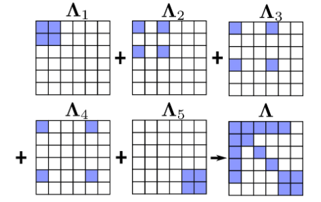

# VINS

### 总结

​	VINS代码主要包含在两个文件中，分别是feature_tracker和vins_estimate，feature_tracker就像文件的名字一样，总体的作用是接收图像，使用KLT光流算法跟踪；vins_estimate包含相机和IMU数据的前端预处理（也就是预积分过程）、单目惯性联合初始化（在线的标定过程）、基于滑动窗口的BA联合优化、全局的图优化和回环检测等。

​	整体分为5部分。

​	第一部分为Measurement Preprocessing：观测值数据预处理，包含图像数据跟踪IMU数据预积分。

​	第二部分为Initialization：初始化，包含单纯的视觉初始化和视觉惯性联合初始化。

​	第三部分为Local Visual-Inertia BA and Relocalization：局部BA联合优化和重定位，包含一个基于滑动窗口的BA优化模型。

​	第四部分为Global Pose Graph Optimization：全局图优化，只对全局的位姿进行优化。

​	第五部分为Loop Detection：回环检测。

### 一、Feature_tracker文件夹中

1. 论文内容：每当进入新的图像，都会使用KLT稀疏光流法进行跟踪，同时提取100-300个角点信息。（可能：角点是用来建立图像，光流跟踪是用来快速定位。）同时在这里还进行了关键帧的选取，主要是两个剔除关键帧的策略，分别是平均视差法和跟踪质量法。平均视差法：如果当前帧的和上一个关键帧跟踪点的平均视差超出了一个设定的阈值，就将当前帧设为关键帧。这里有一个问题，就是旋转和平移都会产生视差（不只是平移哦），当出现纯旋转的时候特征点无法被三角化，无法计算出旋转值，也就无法计算跟踪点间的平均视差，为了解决这一问题，采用短时的陀螺仪观测值来补偿旋转，从而计算出视差，这一过程只应用到平均视差的计算，不会影响真实的旋转结果。
2. 具体代码实现：主要负责图像角点提取和光流跟踪，只有一个主线程。主要是三个源程序，分别是feature_tracker、feature_tracker_node以及parameters。feature_tracker_node是特征跟踪线程的系统入口，feature_tracker是特征跟踪算法的具体实现，parameters是设备等参数的读取和存放。

##### feature_tracker_node.cpp系统入口

- 进入main函数，调用readParameters(n)函数，读取参数。

- 读取相机内参。

- 判断是否是鱼眼，去除边缘噪声。

- 订阅话题和发布话题，监听IMAGE_TOPIC(/cam0/image_raw0)，有图像发布到这个话题上时，执行回调函数，直接进入到回调函数中接收图像。

  - 频率控制，保证每秒钟处理的image不多于FREQ，控制在10hz以内。

  - 处理单目相机，读取图像数据。

    - 如果图像太亮或者太黑，则让图像进行自适应直方图均衡化。如果正常，则设置为当前图像。

    - 在读取图像的时候进行光流跟踪和特征点的提取。这里涉及到3个img(prev_img, cur_img, forw_img)和pts(prev_pts,cur_pts, forw_pts)，两者是相似的。刚开始看不是太好理解，cur和forw分别是LK光流跟踪的前后两帧，forw才是真正的“当前”帧，cur实际上是上一帧，而prev是上一次发布的帧。如果不是第一帧，调用calcOpticalFlowPyrLK()跟踪cur_pts到forw_pts,根据status,把跟踪失败的点剔除(注意:prev, cur,forw, ids, track_cnt都要剔除),这里还加了个inBorder判断,把跟踪到图像边缘的点也剔除掉。在光流追踪成功就记被追踪+1，数值代表被追踪的次数，数值越大，说明被追踪的就越久。

    - 如果不需要发布特征点,则到这步就完了,把当前帧forw赋给上一帧cur, 然后退出.如果需要发布特征点(PUB_THIS_FRAME=1), 则执行下面的步骤。

    - 先调用rejectWithF()对prev_pts和forw_pts做ransac剔除outlier.(实际就是调用了findFundamentalMat函数),。

    - 调用setMask(), 先对跟踪点forw_pts按跟踪次数降排序, 然后依次选点, 选一个点, 在mask中将该点周围一定半径的区域设为0, 后面不再选取该区域内的点. 有点类似与non-max suppression, 但区别是这里保留track_cnt最高的点。

    - 在mask中不为0的区域,调用goodFeaturesToTrack提取新的角点n_pts, 通过addPoints()函数push到forw_pts中, id初始化-1,track_cnt初始化为1。（这里提取的角点可以用在下一帧来的时候进行光流跟踪）

    - 将特征点矫正（相机模型camodocal）后归一化平面的3D点（此时没有尺度信息，3D点p.z=1），像素2D点，以及特征的id，u、v方向上的速度封装成ros的sensor_msgs::PointCloud消息类型的feature_points实例中；将图像封装到cv_bridge::CvImageConstPtr类型的ptr实例中。

    - 发布消息的数据

      pub_img.publish(feature_points);

      pub_match.publish(ptr->toImageMsg())

      将处理完的图像信息用PointCloud实例feature_points和Image的实例ptr消息类型，发布到"feature"和"feature_img"的topic（此步骤在main函数中完成）

至此，已经将图像数据包装成特征点数据和图像数据发布出来了，下面就是在开一个线程，发布一个话题，接收这两种消息，也就是下面的vins_esitimate文件中做的事。

### Vins_estimate文件夹中

##### estimator_node.cpp系统入口

- 首先初始化设置节点vins_estimator，同时读取参数和设置相应的参数，为节点发布相应的话题，为节点订阅三个话题，分别用来接收和保存IMU数据、图像特征数据和原始图像数据，分别是在三个回调函数中imu_callback、feature_callback和raw_image_callback，每当订阅的节点由数据送过来就会进入到相应的回调函数中。
- 在这imu_回调函数中,将IMU数据保存到imu_buf中,同时预测未考虑观测噪声的p,v,q值,同时发布最新的IMU测量值消息,这里计算得到的pvq是估计值(没有观测噪声和偏置的结果),作用是与下面预积分计算得到的pvq(考虑了观测噪声和偏置)做差得到残差.同时唤醒process线程中获取观测值的函数,
  - 在predict()函数中,主要是计算tmp_P(位置),tmp_V(速度),tmp_Q(旋转),见公式(2)(以下的见公式是在崔华坤的文档中的公式)
- 在feature_callback()回调函数中将最新的特征点数据放入缓冲区feature_buf中.
- 如果进行闭环检测,后续才会对原始图像处理,将原始图像放入缓冲区image_buf.
- 多线程处理process(),如果有闭环检测,则会多线程处理process_loop_detection(),process_pose_graph().

##### process线程

- getMeasurements()函数,对IMU和图像数据进行初步对齐,使得一幅图像对应多组IMU数据,并确保图像对应时间戳内所有IMU数据.

  - 如果最新的IMU的数据时间戳小于最旧特征点的时间戳,则等待IMU刷新,如果最旧的IMU数据时间戳大于最旧特征时间戳,则弹出旧图像.
- 调用send_imu()函数,发送IMU数据进行预积分.
  - 获取imu加速度和角速度放入processIMU()函数.**(这里的IMU数据减了bias,不过都是0)**
  - 调用processIMU()函数进行预积分.
    - 假如是第一帧,则只给acc_0,gyr_0赋值,初始化pre_integrations[0]
    - 每一帧都需要初始化一个预积分,如果不是第一帧,则要开始预积分.pre_integration调用push_back()函数存入时间,这一帧的加速度和角速度.
      - 调用propagate()函数,计算两个关键帧之间IMU测量的变化量.
        - 调用midPointIntegration()函数使用中值积分法.得到状态变化量,雅克比矩阵和协方差矩阵.这里面计算的delta_q是这段时间内的变化量.
    - 然后tmp_pre_integration里面也会开始预积分,和pre_integration不一样的是tmp_pre_integration里面存的是当前帧的预积分,而pre_integration里面存了许多帧的预积分.
    - 最后计算Rs,Ps,Vs,这些是整体的R,P,V.
- 接着,取出对应的Feature数据,调用processImage()函数.
  - 检测两帧之间的视差决定是否作为关键帧,同时添加之前检测到的特征点到Feature容器中,计算每一个点跟踪的次数,以及它的视差.
    - 每个Feature有可能出现在多个帧中,将特征放入Feature容器中(这个容器存的是每个Feature出现的Frame)
    - 如果不是第一帧或者当前帧中的特征点在Feature容器中有相同的特征点数目小于20个,则直接判断当前帧为关键帧.
    - 如果上一步没判断为关键帧,在这一步计算视差.遍历每个特征点判断当前特征点至少有两帧观测到.判断倒数第二帧和倒数第三帧的共视关系,实际上是计算两帧中的特征点在归一化平面上的距离.统计视差和以及个数,计算平均视差,如果大于阈值,则边缘化最老的帧,否则不是关键帧,边缘化上一帧.

  - 将图像数据和时间存入图像帧类中:首先将数据和时间保存到图像帧的对象imageframe中,(ImageFrame对象中包含特征点,时间,位姿R,t,预积分对象pre_integration,是否为关键帧),同时将临时的预积分值保存到此对象中,最后将图像帧的对象imageframe保存到all_image_frame对象中,再更新临时预积分初始值.

  - 标定相机和IMU的外参.
    - 获取两帧之间特征点关系.
    - 计算camera和IMU之间的旋转偏移常量.
      - 通过特征点匹配点计算旋转矩阵R放入**Rc(这个变量存的是特征点法算出的旋转矩阵R).**

      - 计算Rimu(这是IMU的旋转矩阵),ric是imu到camera的旋转矩阵,所以计算出了**Rc_g(这个变量的含义是通过IMU估算相机的两帧之间的旋转矩阵).**

      - **然后通过这之前的帧的相机IMU关系构建$(R(q^{b_{k+1}}_{b_k}) - L(q^{c_{k+1}}_{c_k}))q^c_b = 0$(这里的L和R是左乘和右乘的指示)**公式,然后通过最小二乘方法计算IMU到camera的旋转矩阵.这里也有一个技巧,如果特征点计算的Rc和IMU计算的Rimu相差较大,则这个矩阵块的权重较小.

      - **旋转初始化成功判定依据：如果IMU三轴充分旋转，那么4*4矩阵$Q_N$的null space零空间的秩为1，可以得到稳定解；**

        如果旋转退化，则$Q_N$零空间的秩大于1，使用SVD分解，判断倒数第二小（第三大）的奇异值是否大于阈值。

        因此，旋转标定初始化的关键在有**充分的三轴旋转**。

        在VINS代码里,还要确定当前帧大于WINDOW_SIZE的数目.

  - 如果frame_count的数目达到了WINDOW_SIZE(保证有足够的帧进行初始化),并且当前帧的时间大于0.1,则开始进行视觉的结构初始化.调用initialStructure()函数,初始化采用视觉和 IMU 的松耦合方案，首先用 SFM 求解滑窗内所有帧的位姿，和所有路标点的 3D 位置，然后跟 IMU 预积分的值对齐，求解重力方向、尺度因子、陀螺仪 bias 及
    每一帧对应的速度。

    - 首先保证IMU的充分运动.如果线加速度的标准差大于0.25,则代表imu充分激励,足够初始化.
    - 首先构建SFMFeature对象sfm_f，SFMFeature数组中包含了特征点状态（是否被三角化），id，2d点，3d坐标以及深度，将特征管理器中的特征信息保存到SFMFeature对象sfm_f中sfm_f.push_back(tmp_feature)。
    - 调用relativePose()函数,在关键帧中找到和最新的关键帧共视关系较强的关键帧,从对极约束中的F矩阵回复R和t.
      - 依次从滑窗中获取第i帧和最新帧的特征匹配corrs(这个特征匹配是归一化平面上的点),判断corrs有没有大于20个点,再判断视差是否大于一个阈值,则求解这一帧的R和T.**(这个帧是第i帧,并且是整个系统中的初始帧),在代码中i赋值为L.**
    - 全体SFM初始化全部初始帧中的相机位置和特征点空间3D位置.
      - 把relativePose()函数找到的第L帧作为初始位置,最新帧的pose为relative_R,relative_T.
      - 首先进行第L帧和最新一帧的三角化,得到共视的特征点.
      - 然后对L帧之后的帧都和最后一帧进行PnP匹配,再三角化一些点.
      - 然后再以L帧为参考帧,对后面的帧恢复3D点.(这里面的pose存的是对最后一帧的R和T)
      - 再以L帧为参考帧,恢复0-L帧的姿态和3D点.
      - 再根据以上的点,恢复其他的特征点.
      - 建立全局BA,优化位姿和特征点.(第L帧的R和translation,最后一帧的translation都是固定值,不进行优化)
    - 对于非滑动窗口的所有帧,提供一个初始的R,T,然后solvePnP求解pose.
      - 首先要赋给一个初值.(如果是滑动窗口中的R和T,则直接用上面求出的R乘外参矩阵)
      - 然后根据这个初值调用solvePnP求解pose.
    - 调用visualInitialAlign()函数将视觉和IMU的数据对齐.
      - 调用VisualIMUAlignment()函数估计陀螺仪bias,初始化速度,重力向量g和尺度因子,改进重力向量的量值.
        - 调用solveGyroscopeBias()函数进行陀螺仪bias修正.
          - **目标函数为视觉给出的相邻帧间旋转应该等于IMU预积分的旋转值.**解出这个函数就能求出陀螺仪的bias,然后我们需要调用repropagate()函数对所有帧的IMU预积分值重新计算.(**值得注意的是,我们在这里得到的只是bias的变化量,需要在滑窗内累加得到bias的准确值.**)
            - 然后在repropagate()函数中,我们需要对这段时间内的陀螺仪的bias进行更新.在这里会调用propagate()函数(我们在上面sendIMU数据的时候就存了每一帧的dt,acc,gyr数据,在这里我们就用到了).
        - 调用LinearAlignment()函数初始化速度,重力向量g和尺度因子.
          - 在这个函数中,我们想优化的变量为$X_I^{3(n+1)+3+1}= [v_{b_0}^{b_0}, v_{b_1}^{b_1}, ... ,g^{c_0},s]$,残差定义为相邻两帧之间IMU预积分出来的增量$\alpha_{b_{k+1}}^{b_k},\beta_{b_{k+1}}^{b_k}$与预测值之间的误差.主要思想也是通过解线性最小二乘问题获得结果.
          - 接下来调用函数RefineGravity()来纠正重力向量和速度.
            - 如果我们假设重力的模值固定,且其数值为已知量,那这样重力向量的自由度就从3变成了2,因此我们可以将重力向量重新参数化.参数化后,我们获得了$b_1, b_2$,这两个为重力向量正切空间的一对正交基.然后我们需要求解的就是$w_1,w_2$,这两个控制正交基的大小,也控制重力向量的方向,我们需要求解的就是这两个值.
          - 纠正重力向量后,我们也获得了更精确的速度和尺度了.
      - 在估计了陀螺仪的bias,关键帧速度,重力向量g和尺度因子后,我们就差不多完成初始化了,所以我们这个时对以前没有三角化的特征点进行三角化,还有就是调用repropagate()函数重新计算.
      - 最后通过将算出的重力向量g旋转至惯性坐标系(世界系)中的z轴方向,可以计算第一帧相机系到关系系的旋转矩阵$q_{c_0}^w$,这样就可以将所有变量调整至惯性世界系.

  - 如果初始化成功后,我们就开始进入后端优化,首先我们调用solveOdometry()函数.

    - 首先调用triangulate()函数三角化那些还没有得到深度的Features.

    - 接着调用optimization()函数进入优化阶段.VINS紧耦合方案的主要思路就是通过将基于视觉构造的残差项和基于IMU构造的残差项放在一起构造成一个联合优化的问题,整个优化问题的最优解即可认为是比较准确的状态估计.

      为了限制优化变量的数目,VINS-Mono采用了滑动窗口的形式,滑动窗口中的全状态量为

      1. 滑动窗口内n+1个所有相机的状态(包括位置,朝向,速度,加速度计bias和陀螺仪bias)
      2. Camera到IMU的外参
      3. m+1个3D地图点的逆深度

      **这样我们就得到了系统优化的代价函数,总共有3个残差项,分别为边缘化的先验信息,IMU测量残差,还有视觉的观测残差.**

      首先我们可以将计算目标函数的最小值理解为,当优化变量有一个增量时,目标函数值最小,以IMU残差为例,可以写成如下形式:
      $$
      min_{\delta X}|| r_B(\hat{z}_{b_k+1}^{b_k},X+\delta X) ||_{P^{b_k}_{b_k+1}}^2=min_{\delta X}|| r_B(\hat{z}_{b_k+1}^{b_k},X)+H_{b_k+1}^{b_k}\delta X|| _{P^{b_k}_{b_k+1}}^2
      $$
      那么如果要计算增量$\delta X$,我们就需要解得如下公式:
      $$
      {H_{b_k+1}^{b_k}}^T{P_{b_k+1}^{b_k}}^{-1}{H_{b_k+1}^{b_k}}\delta X= -{H_{b_k+1}^{b_k}}^T{P_{b_k+1}^{b_k}}^{-1}r_B
      $$
      既然这样,现在我们有三个残差项,**每个残差项都有一个这样的公式(除了边缘化的先验信息)**,**上面的公式的含义是当协方差越大的时候,也就是信息矩阵(协方差的逆)越小,那么也就意味着这个观测也就越不可信.比如,IMU的噪声协方差较大时,其信息矩阵较小,那么意味这我们将更加相信visual观测.注意,我们这里说的IMU和visual协方差的绝对值没有意义,因为我们考虑的是两者的相对性.**

      - 首先是IMU的测量残差,我们根据上面的IMU预积分,得到**IMU预积分残差(估计值-测量值).**

        **在这里面的估计值为预积分出来的全局变量进行计算得出的两帧之间的增量,而测量值是测量出来的两帧之间的增量,并且测量值消除了加速度bias和角速度bias的影响.**

        又因为我们优化的其实是Mahalanobis距离(**使用马氏距离的原因是为了让IMU残差项和视觉残差项在尺度上保持一致**),
        $$
        d=\mathbf{r^TP^{-1}r}
        $$
        这个优化项其实相当于一个残差加权,协方差大的加权小,协方差小的加权大,着重优化那些比较确定的残差.又因为ceres只接受最小二乘优化,也就是$min\ e^Te$,所以我们需要把$p^{-1}$做一个LLT分解,
        $$
        \mathbf{LL^T=P^{-1}}
        $$
        那么我们令
        $$
        d=\mathbf{r^T(LL^T)r=(L^Tr)^T(L^Tr)}
        $$
        令$\mathbf{r'=(L^Tr)}$作为新的优化误差,所以代码中sqrt_info=$\mathbf{L^T}$

         在优化迭代的过程中,我们会用到IMU测量残差对状态量的雅克比矩阵**,但是在此处我们需要对误差状态量求偏导.**

      - 接下来就是视觉测量残差,视觉测量残差就是特征点的重投影误差.**这里计算重投影误差都是用逆深度来计算的,所以重投影误差都是该特征点的第一帧和后面的帧来计算重投影误差.**

        **同时注意到这里有个UNIT_SPHERE_ERROR的选项,如果我们将归一化平面上的重投影误差投影到Unit sphere上,那么就能支持所有类型的相机了.**

        **和IMU的测量残差项一样,这里的视觉误差项也需要乘一个协方差矩阵,因为视觉约束的噪声协方差矩阵与标定相机内参时的重投影误差(也就是偏离几个像素有关),所以这个矩阵是固定的,这里为$\frac{f}{1.5}$.**

        和IMU测量残差项一样,在这里我们也需要计算雅克比矩阵,为视觉残差项对两个时刻的状态量,外参以及逆深度求导.

      - 在构造了上面两个误差项后,就直接调用了ceres优化,优化完后才进入边缘化.

        最后就是边缘化了.**滑窗限制了关键帧的数量,防止pose和feature的个数不会随时间不断增加,使得优化问题始终在一个有限的复杂度内,不会随着时间不断增长.**

        **然而,当pose移除windows时,有些约束会被丢弃,这样势必会导致求解的精度下降,而且当进行一些退化运动(比如匀速运动)的话,没有历史信息作约束的话是误差进行求解的.所以,在移出位姿或者特征的时候,需要将相关联的约束转为一个约束项作为prior放到优化问题中,这就是边缘化要做的事情.**

        **边缘化的过程就是将滑窗内的某些较旧或者不满足要求的视觉帧剔除的过程,所以边缘化也被描述为将联合概率分布分解为边缘概率分布和条件概率分布的过程.(这就是相当于利用舒尔补减少优化参数的过程.)**

        直接进行边缘化而不加入先验条件的后果:

        1. 无故移除这些pose和feature会丢弃帧间约束,这样会降低优化器的精度,所以需要在移除pose和feature的时候将相关联的约束转变为一个先验的约束条件作为prior.
        2. 在边缘化的过程中,不加先验的边缘化会导致系统尺度的缺失,尤其是系统在进行退化运动时(如无人机的悬停和恒速运动).**一般来说,只有当两个轴向的加速度不为0的时候,才能保证尺度可观,而退化运动对于无人机和机器人来说是不可避免的.**所以在系统处于退化运动的时候,要加入先验信息保证尺度的可观性.

        在VINS中,为了处理一些悬停的case,引入了一个two-way marginalization:

        1. MARGIN_OLD: 如果次新帧为关键帧,则丢弃滑动窗口内最老的图像帧,同时对该图像帧关联的约束项进行边缘化处理.**这里需要注意的是,如果该关键帧是观测到某个地图点的第一帧,则需要把该地图点的深度转移到后面的图像帧中去.**
        2. MARGIN_NEW: 如果次新帧不是关键帧,则丢弃次新帧.因为判定当前帧不是关键帧的条件就是当前帧与次新帧时差很小,也就是说当前帧和次新帧很相似,这种情况下直接丢弃次新帧,然后用当前帧代替次新帧.为什么这里可以不对次新帧进行边缘化,而是直接丢弃,原因就是当前帧和次新帧很相似,因此当前帧与地图点之间的约束和次新帧与地图点之间的约束是很接近的,直接丢弃并不会造成整个约束关系丢失信息.这里需要注意的是,要把当前帧和次新帧之间的IMU预积分转换为当前帧和次新帧前一帧之间的IMU预积分.

        在悬停等运动较小的情况下,会频繁的MARGIN_NEW,这样也就保留了那些比较旧但是视差比较大的pose.这种情况如果一直MARGIN_OLD的话,视觉越是不够强,状态估计会受IMU积分误差影响,具有较大的累计误差.

        根据之前的对高斯牛顿的非线性优化理论可知,$H\delta x=b$可写成如下形式:
        $$
        \left [\begin{matrix} \Lambda_a & \Lambda_b \\ \Lambda_b^T & \Lambda_b \end{matrix}\right ]\left [\begin{matrix} \delta x_a \\ \delta x_b  \end{matrix}\right ] = \left [\begin{matrix} g_a \\ g_b \end{matrix}\right ]
        $$
        值得说明的是,上面这个公式中的$\delta x_a, \delta x_b$并非一定为相机位姿部分和路标部分,而是希望margin的部分和希望保留的部分.另外,VINS中的边缘化和G2O计算过程中的边缘化意义不大相同.G2O中对路标点设置边缘化是为了在求解过程中先消去路标点变量,实现先求解位姿,然后再利用求解出来的相机位姿反过来计算路标点的过程,目的是为了加速求解,并非真的将路标点给边缘化掉.而VINS中则真正需要边缘化掉滑动窗口中的最老帧或者最新帧,目的是希望不再计算这一帧的位姿或者与其相关的路标点,但是希望保留该帧对窗口内其他帧的约束关系.

        假设上式中的$x_a$是我们要margin的变量,比如一个相机的pose,因此我们更关心如果只去求解我们希望保留的变量$\delta x_a$,同时我们又不能直接将$\delta x_a$和与其相关的路标点等信息直接删除,因为这样会减少约束,丢失信息.因此会采用schur进行消元.
        $$
        (\Lambda _c-\Lambda^T\Lambda_a^{-1}\Lambda_b)\delta x_b = g_b-\Lambda_b^T\Lambda_a^{-1}g_a
        $$
        值得说明的是,上面的公式即为要保留变量$\delta x_b$的先验信息.

        - 边缘化的第一步是定义损失函数,这个定义损失函数和前面的IMU项,视觉项差不多,都重载了损失函数类ceres::CostFunction,重载了函数Evaluate(),这个函数传入优化变量parameters以及先验值(这个就是上一时刻的先验残差last_marginalization_info),可以计算出各项残差值residuals,以及残差对应各个优化变量的雅克比矩阵.

        - 第二步定义ResidualBlockInfo,这一步是为了将不同的损失函数和优化变量统一起来再一起添加到marginalization_info中,另外对于边缘化来说还有一个特殊的优化变量那就是优化变量的位置drop_set.

          在这里面有几个变量很重要,parameter_block_size为优化变量的长度,parameter_block_idx为优化变量的id,parameter_block_data为优化变量对应的double指针类型的数据.

          对于先验损失,其待边缘化优化变量是根据是否等于para_pose[0]或者para_SpeedBias[0],也就是说和第一帧相关的优化变量都作为边缘化的对象.
          
          对于IMU,其输入的drop_set是vector{0, 1},也就是说其待边缘化优化变量为para_Pose[0],para_SpeedBias[0],也是第一帧相关的变量都作为边缘化的对象.**这里值得注意的是和后端优化不同,这里只添加了第一帧和第二帧的相关变量作为优化变量,因此边缘化构造的信息矩阵会比后端优化构造的信息矩阵要小.**
          
          而对于视觉来说,其输入的drop_set为vector{0, 3},也就是说其待边缘化变量为para_Pose[imu_i]和para_Feature[feature_index],**从这里看出VINS的边缘化操作不仅仅会边缘化第一帧相关的优化变量,还会边缘化掉以第一帧为起始观察帧的路标点.**
        
        - 第三步则是将定义的residual_block_info添加到marginalization_info中,将优化变量的大小存入parameter_block_size,但是parameter_block_idx中仅存有优化变量的内存地址的key,其对应的value全部为0.
        
        - 上面我们已经确定了优化变量的数量,存储位置,长度和待优化变量的数量以及存储位置.接下来我们就要调用preMarginalize()函数进行预处理.
        
        这个函数通过传入的优化变量值以及先验值可以计算出各项残差值以及雅克比矩阵,
        
        - 接着就是调用marginalize()函数正式开始边缘化操作了.
        
        在函数中会计算m和n的值,这两个值分别为待边缘化的优化变量的维度以及保留的优化变量的维度.
        
        然后函数会通过多线程快速构造各个残差对应的各个优化变量的信息矩阵,然后加在一起,如下图所示:
        
        
        
        因为这里构造信息矩阵时采用的正是parameter_block-idx作为构造顺序,因此就会将待边缘化的变量构造在矩阵的左上方.
        
        接着函数会通过shur补操作进行边缘化,然后再从边缘化后的信息矩阵中恢复出来的雅克比矩阵和残差,这两者会作为先验残差代入到下一轮的先验残差的雅克比和残差的计算中.
        
        - 在最后有一个滑窗预一点的操作.这里仅仅只是相当于将指针进行了一次移动,指针对应的数据还是旧数据,所以需要结合后面调用的slideWindow()函数才能实现真正的滑窗移动.
        
        **(最后我们需要明确一个概念就是,边缘化操作并不会改变优化变量的值,而仅仅只是改变了优化变量之间的关系,而这些关系就是通过信息矩阵体现的.)**
      
      - 接下来调用slideWindow()函数,这个函数中就是进行滑窗,对上面的数据进行移动,然后去除特征点和图像数据.

##### 回环检测(pose_graph_node.cpp)

在这个cpp文件中,首先定义了全局变量posegraph.在定义了这个变量的过程中,由于posegraph的初始化,因此开启了一个持续不断的新线程:

optimize4DOF(),即全局优化一个4自由度的过程.该线程由于IMU的存在,使得6自由度的问题一下子降了两维,并且每结束一次优化的过程,该线程就会睡眠2秒中,再继续.optimize4DOF优化的前提条件:optimize_buf不等于空.添加optimize_buf的内容只有两个地方,一个是addKeyFrame()函数,一个是loadKeyFrame()函数.

loadKeyFrame()函数：只要在LOAD_PREVIOUS_POSE_GRAPH有，即我们有原来的地图信息，加载的时候，才会发生。

addKeyFrame()函数：外部调用类pose_graph的第一个函数。即通过findConnection()函数判断是否有检测到回环，检测到后满足一定条件就把回环帧的序号添加optimize_buf内部。

在整个回环检测程序中都是为了维护main函数里面定义的全局变量posegraph来进行的.这里面重要的成员变量为:

list<KeyFrame*>keyframelist: 这是最重要的类成员,整个回环检测的过程就是用来维护这个关键帧链表list,当检测到回环的时候,更新这个链表的数据,即关键帧的位姿.

BriefDatabase db:图像数据库信息,通过不断更新这个数据库,可以用来查询,即回环检测有没有回到之前曾经来过的地方.

- 首先在main()函数中会调用loadVocabulary()函数.

- 然后如果要加载地图则会调用loadPoseGraph()函数.

  - 首先读取一些列文件,然后准备加载所有的Keyframe.
  - 在读取了Keyframe的参数后,构造Keyframe.
  - 调用loadKeyFrame()函数
    - 然后在这里面会用到flag_detect_loop这个标志,如果是加载则为0,如果是新建则为1.那么我们是新建的Keyframe,则需要调用detectLoop()函数.在这个函数中我们能够获得具有最小index的历史关键帧.
    - 得到上面的匹配关键帧后,通过计算相对位姿,我们可以把当前帧号记录到全局优化中.

- 开启一个新线程process().这个函数只有当image_buf,pose_buf和point_buf三个buf都不为空的时候才进行运行,否则程序就休息5毫秒,继续检测.

  其中image_buf存放的是image_callback()图像回调函数的信息,接收相机话题的原始图片.并且当两张图片的时间戳相差1秒,或者说当图片的时间戳小于上一帧的时间戳,可以认为图像出现新序列,因此new_sequence().

  point_buf存放的是point_callback()关键帧的三维特征点信息的回调.并且在这三个回调函数中,同时利用point_cloud标准数据结构发布特征点三维点云以供可视化操作.

  pose_buf存放的是pose_callback()回调函数的信息.这里面是vio得到的关键帧的位姿信息.

  从上面的信息我们可以看出,只有当相机有关键帧的时候,才会进行进一步处理,整个loop_fusion处理的信息不是原始图像,而是一帧帧关键帧.

  - 接着程序开始找一帧Keyframe对应image_buf,point_buf和pose_buf三者的数据.即point_buf和pose_buf整个储存的点云和位姿是对应image_buf里面的哪一帧关键帧.最终的结果是
    1. image_msg存放关键帧的图像原始信息.
    2. point_msg存放了该关键帧里面的3D点云信息,由VIO以及pose_graph.r_drift和pose_graph.t_drift解算得到.
    3. pose_msg存放了该关键帧的位置

  - 根据上面得到的三个信息来构造关键帧.用数据结构KeyFrame来表示,这里先跳过了前十个数据.在这个KeyFrame的构造函数中默认没有brief_descriptor,因为我们VIO前端提取时并不需要特征点的描述子.在构造关键帧的时候,函数同时又增加了阈值大于20的FAST角点,来增加关键帧特征点的数量,同时对这些特征点用相应的描述子来进行表述.

    **注意只有当两个关键帧之间的位移量大于SKIP_DIS的时候才会构造新的关键帧.但是程序默认的SKIP_DIS为0.**

- 构造好的Keyframe通过posegraph.addKeyFrame()加入到全局姿态图中去.这其中第二个参数代表需要回环检测detect_loop,这里直接默认需要.

  - 检测该关键帧的序号是否有跳变,整个loop_fusion里面,每次出现new_sequence()的时候,关键帧的sequence会自增1,为什么一直要关心一个关键帧的sequence呢?因为这里一个关键帧的位姿的参考系是建立在某一个sequence下面的,不同的sequence对应了不同的w_t_vio,w_r_vio,就是该sequence和base_sequence之间坐标系的转换.
  - posegraph坐标系是以world frame作为坐标系的，world frame为base sequence(载入原来的图像数据库)或者（没有载入图像数据库的话）用sequence=1的序列作为坐标系。PoesGraph里面的两个类成员 w_t_vio,w_r_vio描述的就是当前序列的第一帧，与世界坐标系之间的转换关系。
  - 通过detectLoop()，查找到一个最合适得分最高的闭环候选帧（如果没找到，loop_index=-1）,此时本质是通过bag of word中的db.query()来进行查找的。并且无论有没有查找到，都用db.add()把当前关键帧的描述子添加到图像的数据库db中去。
  - 若detectLoop()能够找到相似的一帧，此时，通过findConnection() 判断新旧两帧关联，匹配点大于25对，相对的偏航角位移小于30度并且相对位移少于20m，则返回true,其余情况均返回false。在true的条件下，更新参考系转化的变量。并且把当前帧的序号加入到optimize_buf中去。
  - 最终，把该帧keyframe 添加到keyframelist中去。从此，keyframelist又增添了一个关键帧元素。

这个时候optimize_buf就放入了刚刚存进去的Keyframe,就会开始调用optimize4DOF()函数.

不过这里只优化4个参数,即yaw角度,x,y,z.