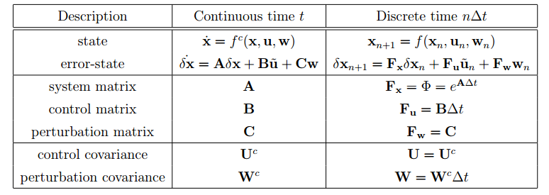

[TOC]

## ESKF

### ESKF优点

- 方向错误很小,有着和自由度相同的参数,这样避免了过参数化的问题.
- ESKF基本在原点进行处理,这样可以避免一些奇异和万向锁问题.
- 误差状态通常来说很小,这样能够保证所有的二阶乘积可以忽略不计.这就能让雅克比的计算量变小,计算的很快.一些雅克比甚至是恒定的.
- 误差变化很慢,所以我们修正误差能用一个很慢的速度.

### 大致流程

在误差状态滤波器中,我们通常有这几个值,称为真值,标称值和误差值.真值是标称值和误差的组合.ESKF的思想是将标称状态看做大信号(以非线性方式可积),将误差状态视为小信号(因此线性可积,适用于线性高斯滤波).

一方面,高频率IMU数据$u_m$被集成到标称状态$x$.这个标称状态没有考虑到噪声$w$和其他的一些误差.所以这个标称状态会累计误差.这些误差被集成到误差状态$\delta x$并且通过ESKF估计出来.这个误差状态包含所有的噪声和扰动.所以我们可以看出,误差状态由小信号组成,其推导函数由线性动态系统定义,这个推导矩阵由标称状态计算得出.在标称状态的积分同时,ESKF也会预测误差状态的高斯估计.这里只会预测,因为到目前为止我们没有其他测量能用于纠正这些估计.滤波器的矫正通常在IMU以外的数据到达时进行,比如GPS信息,视觉信息,这些信息通常能够观测到这些误差,并且速率比IMU的速率低得多.在此之后,错误状态的平均值被注入到标称状态,然后重置为零.错误状态的协方差矩阵会很方便的更新以反映这个重置,然后系统这样继续运行下去.

### 连续时间的系统运动

上图表示了在ESKF中的所有变量.有几个值得注意的点.

- 角速度$\omega$是定义为局部的标称四元数.这让我们能够直接使用陀螺仪测量的角速度$\omega_m$.
- 角速度误差$\delta \theta$也是定义为局部的标称四元数.有论文证明使用全局定义角度误差有更好的性质.

#### 运动真值

真值运动公式为:
$$
\begin{array}a \dot{\mathbf{p}}_{t} &=\mathbf{v}_{t} \\ \dot{\mathbf{v}}_{t} &=\mathbf{a}_{t} \\ \dot{\mathbf{q}}_{t} &=\frac{1}{2} \mathbf{q}_{t}\otimes \omega_{t} \\ \dot{\mathbf{a}}_{b t} &=\mathbf{a}_{w} \\ \dot{\boldsymbol{\omega}}_{b t} &=\boldsymbol{\omega}_{w} \\ \dot{\mathbf{g}}_{t} &=0 \end{array}
$$
真值$a_t$和$\omega_t$由测量值算得:
$$
\begin{array} \mathbf{a}_{m} &=\mathbf{R}_{t}^{\top}\left(\mathbf{a}_{t}-\mathbf{g}_{t}\right)+\mathbf{a}_{b t}+\mathbf{a}_{n} \\ \boldsymbol{\omega}_{m} &=\boldsymbol{\omega}_{t}+\boldsymbol{\omega}_{b t}+\boldsymbol{\omega}_{n} \end{array}
$$
在这里的$\omega_m$中少了地球自转角速度,如果在比较高精度的IMU系统中,地球自转角速度是不能省略的.$\omega_{m}=\omega_{t}+\mathbf{R}_{t}^{\top} \omega_{\mathcal{E}}+\omega_{b t}+\omega_{n}$,$\omega_{\mathcal{E}}=15^{\circ} / \mathrm{h} \approx 7.3 \cdot 10^{-5} \mathrm{rad} / \mathrm{s}$.
$$
\begin{array} \mathbf{a}_{t} &=\mathbf{R}_{t}\left(\mathbf{a}_{m}-\mathbf{a}_{b t}-\mathbf{a}_{n}\right)+\mathbf{g}_{t} \\ \boldsymbol{\omega}_{t} &=\boldsymbol{\omega}_{m}-\boldsymbol{\omega}_{b t}-\boldsymbol{\omega}_{n} \end{array}
$$
将上面的公式代入真值运动公式后得:
$$
\begin{array}a \dot{\mathbf{p}}_{t} &=\mathbf{v}_{t} \\ \dot{\mathbf{v}}_{t} &=\mathbf{R}_{t}\left(\mathbf{a}_{m}-\mathbf{a}_{b t}-\mathbf{a}_{n}\right)+\mathbf{g}_{t} \\ \dot{\mathbf{q}}_{t} &=\frac{1}{2} \mathbf{q}_{t} \otimes\left(\boldsymbol{\omega}_{m}-\boldsymbol{\omega}_{b t}-\boldsymbol{\omega}_{n}\right) \\ \dot{\mathbf{a}}_{b t} &=\mathbf{a}_{w} \\ \dot{\boldsymbol{\omega}}_{b t} &=\boldsymbol{\omega}_{w} \\ \dot{\mathbf{g}}_{t} &=0 \end{array}
$$
我们定义$\dot{\mathbf{x}}_{t}=f_{t}\left(\mathbf{x}_{t}, \mathbf{u}, \mathbf{w}\right)$,其中:
$$
\mathbf{x}_{t}=\left[\begin{array}{c}{\mathbf{p}_{t}} \\ {\mathbf{v}_{t}} \\ {\mathbf{q}_{t}} \\ {\mathbf{a}_{b t}} \\ {\boldsymbol{\omega}_{b t}} \\ {\mathbf{g}_{t}}\end{array}\right] \quad \mathbf{u}=\left[\begin{array}{c}{\mathbf{a}_{m}-\mathbf{a}_{n}} \\ {\boldsymbol{\omega}_{m}-\boldsymbol{\omega}_{n}}\end{array}\right] \quad \mathbf{w}=\left[\begin{array}{c}{\mathbf{a}_{w}} \\ {\boldsymbol{\omega}_{w}}\end{array}\right]
$$
值得注意的是,上面的$g_t$是要通过滤波器进行估计的.$g_t$在上面被视为常值.整个系统以一个固定的且任意的方向开始$\mathrm{q}_{t}(t=0)=\mathrm{q}_{0}$,通常来说不是一个水平面,这会使得初始重力向量是未知的.简单来说,我们一般取$\mathbf{q}_{0}=(1,0,0,0)$,因此$\mathbf{R}_{0}=\mathbf{R}\left\{\mathbf{q}_{0}\right\}=\mathbf{I}$.我们要在$q_0$的框架上估计重力$g_t$,而不是估计水平面上的$q_t$,这样初始方向上的不确定性就转到了重力方向上的不确定性.我们通过以下方法来改善线性度.我们的公式是和$g$线性相关的,这样所有的不确定性都在$g$上了,初始方向$q_0$是已知的且没有不确定性.(这个公式中的$g$现在是未知的,是要估计出来的)一旦这个重力向量被估计出来,这个水平面就能被恢复,整个状态和恢复的运动轨迹就能重新构建以适应估计的水平面.当然也可以采用$\mathbf{g} \triangleq(0,0,-9.8 x x)$,然后使用一个不确定的初始方向$q_0$.

#### 运动标称状态

运动标称状态如下:(**这里的标称状态也就是nominal-state,代表着不含任何误差的理想值.**)

也就是说,如果我们将公式(2)中的真值写成标称值加误差项的形式的话:
$$
w_{m}=(w+\delta w)+\left(w_{b}+\delta w_{b}\right)+w_{n}
$$
若将上面状态认为是标称状态,则不考虑任何误差和噪声项,即上式中的$\delta w, \delta w_b,w_n$,则上式可写为
$$
\begin{array}{l}{w_{m}=(w+0)+\left(w_{b}+0\right)+0} \\ {\Rightarrow w_{m}=w+w_{b}} \\ {\Rightarrow w=w_{m}-w_{b}}\end{array}
$$
下面是标称运动状态的运动学表达式
$$
\begin{array} q\dot{\mathbf{p}} &=\mathbf{v} \\ \dot{\mathbf{v}} &=\mathbf{R}\left(\mathbf{a}_{m}-\mathbf{a}_{b}\right)+\mathbf{g} \\ \dot{\mathbf{q}} &=\frac{1}{2} \mathbf{q} \otimes\left(\boldsymbol{\omega}_{m}-\boldsymbol{\omega}_{b}\right) \\ \dot{\mathbf{a}}_{b} &=0 \\ \dot{\boldsymbol{\omega}}_{b} &=0 \\ \dot{\mathbf{g}} &=0 \end{array}
$$

#### 运动误差状态

我们的目标是获得误差状态的运动学模型线性表示.在运动误差状态中,是没有噪声和扰动的.
$$
\begin{array} a\dot{\delta \mathbf{p}} &=\delta \mathbf{v} \\ \dot{\delta \mathbf{v}} &=-\mathbf{R}\left[\mathbf{a}_{m}-\mathbf{a}_{b}\right]_{ \times} \delta \boldsymbol{\theta}-\mathbf{R} \delta \mathbf{a}_{b}+\delta \mathbf{g}-\mathbf{R} \mathbf{a}_{n} \\ \dot{\delta} \boldsymbol{\theta} &=-\left[\boldsymbol{\omega}_{m}-\boldsymbol{\omega}_{b}\right]_{ \times} \delta \boldsymbol{\theta}-\delta \boldsymbol{\omega}_{b}-\boldsymbol{\omega}_{n} \\ \delta \dot{\mathbf{a}}_{b} &=\mathbf{a}_{w} \\ \delta \dot{\boldsymbol{\omega}}_{b} &=\boldsymbol{\omega}_{w} \\ \dot{\delta \mathbf{g}} &=0 \end{array}
$$

##### 线性速度误差

我们希望获得速度的运动学模型,从以下公式开始
$$
\begin{array} \mathbf{R}_{t} &=\mathbf{R}\left(\mathbf{I}+[\delta \boldsymbol{\theta}]_{ \times}\right)+O\left(\|\delta \boldsymbol{\theta}\|^{2}\right) \\ \dot{\mathbf{v}} &=\mathbf{R} \mathbf{a}_{\mathcal{B}}+\mathbf{g} \end{array}
$$
上面公式中的$R_t$是小信号近似,然后定义如下公式:
$$
\begin{array}{c}{\mathbf{a}_{\mathcal{B}} \triangleq \mathbf{a}_{m}-\mathbf{a}_{b}} \\ {\delta \mathbf{a}_{\mathcal{B}} \triangleq-\delta \mathbf{a}_{b}-\mathbf{a}_{n}}\end{array}
$$
然后我们获得了加速度真值的新的表达式
$$
\mathbf{a}_{t}=\mathbf{R}_{t}\left(\mathbf{a}_{\mathcal{B}}+\delta \mathbf{a}_{\mathcal{B}}\right)+\mathbf{g}+\delta \mathbf{g}
$$
然后我们得到了$\dot{\mathbf{v}}_{t}$的两种表达形式,其中$O\left(\|\delta \boldsymbol{\theta}\|^{2}\right)$省略了.
$$
\dot{\mathbf{v}}+\dot{\delta \mathbf{v}}=\dot{\mathbf{v}}_{t}=\mathbf{R}\left(\mathbf{I}+[\delta \boldsymbol{\theta}]_{ \times}\right)\left(\mathbf{a}_{\mathcal{B}}+\delta \mathbf{a}_{\mathcal{B}}\right)+\mathbf{g}+\delta \mathbf{g}
$$

$$
\mathbf{R} \mathbf{a}_{\mathcal{B}}+\mathbf{g}+\dot{\delta} \mathbf{v}=\mathbf{R} \mathbf{a}_{\mathcal{B}}+\mathbf{R} \delta \mathbf{a}_{\mathcal{B}}+\mathbf{R}[\delta \boldsymbol{\theta}]_{ \times} \mathbf{a}_{\mathcal{B}}+\mathbf{R}[\delta \boldsymbol{\theta}]_{ \times} \delta \mathbf{a}_{\mathcal{B}}+\mathbf{g}_{\mathcal{B}}
$$

推出
$$
\dot{\delta \mathbf{v}}=\mathbf{R}\left(\delta \mathbf{a}_{\mathcal{B}}+[\delta \boldsymbol{\theta}]_{ \times} \mathbf{a}_{\mathcal{B}}\right)+\mathbf{R}[\delta \boldsymbol{\theta}]_{ \times} \delta \mathbf{a}_{\mathcal{B}}+\delta \mathbf{g}
$$
去除二阶小量即可获得
$$
\dot{\delta \mathbf{v}}=\mathbf{R}\left(\delta \mathbf{a}_{\mathcal{B}}-\left[\mathbf{a}_{\mathcal{B}}\right]_{ \times} \delta \boldsymbol{\theta}\right)+\delta \mathbf{g}
$$
调用公式(9),即可得:
$$
\dot{\delta \mathbf{v}}=\mathbf{R}\left(-\left[\mathbf{a}_{m}-\mathbf{a}_{b}\right]_{ \times} \delta \boldsymbol{\theta}-\delta \mathbf{a}_{b}-\mathbf{a}_{n}\right)+\delta \mathbf{g}
$$
适当的调整之后,我们得到以下的表达
$$
\dot{\delta \mathbf{v}}=-\mathbf{R}\left[\mathbf{a}_{m}-\mathbf{a}_{b}\right]_{ \times} \delta \boldsymbol{\theta}-\mathbf{R} \delta \mathbf{a}_{b}+\delta \mathbf{g}-\mathbf{R} \mathbf{a}_{n}
$$
为了简化这个表达,我们常常假设加速度噪声是白噪声,这代表均值和协方差矩阵在旋转的时候不变($\mathbb{E}\left[\mathbf{R} \mathbf{a}_{n}\right]=\mathbf{R} \mathbb{E}\left[\mathbf{a}_{n}\right]=0$,$\mathbf{E}\left[\left(\mathbf{R} \mathbf{a}_{n}\right)\left(\mathbf{R} \mathbf{a}_{n}\right)^{\top}\right]=\mathbf{R} \mathbb{E}\left[\mathbf{a}_{n} \mathbf{a}_{n}^{\top}\right] \mathbf{R}^{\top}=\mathbf{R} \sigma_{a}^{2} \mathbf{I} \mathbf{R}^{\top}=\sigma_{a}^{2}\mathbf{I}$).这样我们就能重新定义加速度噪声向量,
$$
\mathbf{a}_{n} \leftarrow \mathbf{R} \mathbf{a}_{n}
$$
这样公式(15)就变成下面这样:
$$
\delta \mathbf{v}=-\mathbf{R}\left[\mathbf{a}_{m}-\mathbf{a}_{b}\right]_{ \times} \delta \boldsymbol{\theta}-\mathbf{R} \delta \mathbf{a}_{b}+\delta \mathbf{g}-\mathbf{a}_{n}
$$

#####　方向误差

我们希望定义$\dot{\delta\theta}$,角度误差的运动学方程,和上面的速度误差公式一样,我们首先得出以下公式
$$
\begin{array} \dot{\mathbf{q}}_{t} &=\frac{1}{2} \mathbf{q}_{t} \otimes \boldsymbol{\omega}_{t} \\ \dot{\mathbf{q}} &=\frac{1}{2} \mathbf{q} \otimes \boldsymbol{\omega} \end{array}
$$

同时,我们定义了加速度的大信号和小信号,
$$
\begin{array}{c}{\omega \triangleq \omega_{m}-\omega_{b}} \\ {\delta \omega \triangleq-\delta \omega_{b}-\omega_{n}}\end{array}
$$
所以现在$\omega_t$可以被写成一个标称状态和一个误差状态的组合:
$$
\boldsymbol{\omega}_{t}=\boldsymbol{\omega}+\delta \boldsymbol{\omega}
$$
我们可以获得两种不同的$\dot{\mathbf{q}}_{t}$,
$$
\dot{(\mathbf{q} \otimes \delta \mathbf{q})}=\dot{\mathbf{q}}_{t}=\frac{1}{2} \mathbf{q}_{t} \otimes \boldsymbol{\omega}_{t} = \frac{1}{2}\mathbf{q}\otimes\delta q\otimes\omega_t
$$

$$
\dot{\mathbf{q}} \otimes \delta \mathbf{q}+\mathbf{q} \otimes \dot{\delta} \mathbf{q}=\frac{1}{2} \mathbf{q} \otimes \delta \mathbf{q} \otimes \boldsymbol{\omega}_{t}
$$

$$
\frac{1}{2} \mathbf{q} \otimes \omega \otimes \delta \mathbf{q}+\mathbf{q} \otimes \dot{\delta} \mathbf{q}=\frac{1}{2} \mathbf{q} \otimes \delta \mathbf{q} \otimes \boldsymbol{\omega}_{t}
$$

现在我们想要求$\dot{\delta \theta}$,我们首先用上面的公式获得以下结果:
$$
\begin{array}
2q\otimes \dot{\delta q}&=q\otimes \delta q \otimes w_t - q\otimes w\otimes\delta q\\
&=q\otimes(\delta q\otimes w_t - w\otimes \delta q)\end{array}
$$
然后:
$$
\begin{align}\left[\begin{array}{c}{0} \\ {\delta \boldsymbol{\theta}}\end{array}\right]&=2 \dot{\delta \mathbf{q}}=\delta \mathbf{q} \otimes \boldsymbol{\omega}_{t}-\boldsymbol{\omega} \otimes \delta \mathbf{q}\\
&=[\mathbf{q}]_{R}\left(\boldsymbol{\omega}_{t}\right) \delta \mathbf{q}-[\mathbf{q}]_{L}(\boldsymbol{\omega}) \delta \mathbf{q}\\
&=\left[\begin{array}{cc}{0} & {-\left(\omega_{t}-\omega\right)^{\top}} \\ {\left(\omega_{t}-\omega\right)} & {-\left[\omega_{t}+\omega\right]_{ \times}}\end{array}\right]\left[\begin{array}{c}{1} \\ {\delta \boldsymbol{\theta} / 2}\end{array}\right]+O\left(\|\boldsymbol{\delta} \boldsymbol{\theta}\|^{2}\right)\\
&=\left[\begin{array}{cc}{0} & {-\delta \omega^{\top}} \\ {\delta \omega} & {-[2 \omega+\delta \omega]_{ \times}}\end{array}\right]\left[\begin{array}{c}{1} \\ {\delta \boldsymbol{\theta} / 2}\end{array}\right]+O\left(\|\delta \boldsymbol{\theta}\|^{2}\right)\end{align}
$$
这就是产生了两个公式:
$$
\begin{align} 0 &=\delta \boldsymbol{\omega}^{\top} \delta \boldsymbol{\theta}+O\left(|\delta \boldsymbol{\theta}|^{2}\right) \\ \dot{\delta} \boldsymbol{\theta} &=\delta \boldsymbol{\omega}-[\boldsymbol{\omega}]_{ \times} \delta \boldsymbol{\theta}-\frac{1}{2}[\delta \boldsymbol{\omega}]_{ \times} \delta \boldsymbol{\theta}+O\left(\|\delta \boldsymbol{\theta}\|^{2}\right) \end{align}
$$
如果忽略了二阶以上的高阶项,我们就能得到以下的公式:
$$
\dot{\delta \boldsymbol{\theta}}=-[\boldsymbol{\omega}]_{\mathbf{x}} \delta \boldsymbol{\theta}+\delta \boldsymbol{\omega}
$$
代入公式(22),我们就能得到:
$$
\dot{\delta \boldsymbol{\theta}}=-\left[\boldsymbol{\omega}_{m}-\boldsymbol{\omega}_{b}\right]_{ \times} \delta \boldsymbol{\theta}-\delta \boldsymbol{\omega}_{b}-\boldsymbol{\omega}_{n}
$$

### 离散时间的系统运动

#### 标称状态运动学

我们可以将标称状态运动学差分公式写成如下形式:
$$
\begin{array}{l}{\mathbf{p} \leftarrow \mathbf{p}+\mathbf{v} \Delta t+\frac{1}{2}\left(\mathbf{R}\left(\mathbf{a}_{m}-\mathbf{a}_{b}\right)+\mathbf{g}\right) \Delta t^{2}} \\ {\mathbf{v} \leftarrow \mathbf{v}+\left(\mathbf{R}\left(\mathbf{a}_{m}-\mathbf{a}_{b}\right)+\mathbf{g}\right) \Delta t} \\ {\mathbf{q} \leftarrow \mathbf{q} \otimes \mathbf{q}\left\{\left(\boldsymbol{\omega}_{m}-\boldsymbol{\omega}_{b}\right) \Delta t\right\}} \\ {\mathbf{a}_{b} \leftarrow \mathbf{a}_{b}} \\ {\boldsymbol{\omega}_{b} \leftarrow \boldsymbol{\omega}_{b}} \\ {\mathbf{g} \leftarrow \mathbf{g}}\end{array}
$$
其中,$x \leftarrow f(x, \bullet)$代表着时间更新$x_{k+1}=f\left(x_{k}, \bullet_{k}\right)$,$\mathbf{R} \triangleq \mathbf{R}\{\mathbf{q}\}$是当前标称旋转$\mathbf{q}$的旋转矩阵,$\mathrm{q}\{v\}$是旋转$v$的四元数.

#### 误差状态运动学

标称状态部分通常都是确定的,而误差部分的积分通常都要加上随机脉冲,公式如下
$$
\begin{array} {}\delta \mathbf{p} & \leftarrow \delta \mathbf{p}+\delta \mathbf{v} \Delta t \\ \delta \mathbf{v} & \leftarrow \delta \mathbf{v}+\left(-\mathbf{R}\left[\mathbf{a}_{m}-\mathbf{a}_{b}\right]_{ \times} \delta \boldsymbol{\theta}-\mathbf{R} \delta \mathbf{a}_{b}+\delta \mathbf{g}\right) \Delta t+\mathbf{v}_{\mathbf{i}} \\ \delta \boldsymbol{\theta} & \leftarrow \mathbf{R}^{\top}\left\{\left(\boldsymbol{\omega}_{m}-\boldsymbol{\omega}_{b}\right) \Delta t\right\} \delta \boldsymbol{\theta}-\delta \boldsymbol{\omega}_{b} \Delta t+\boldsymbol{\theta}_{\mathbf{i}} \\ \delta \mathbf{a}_{b} & \leftarrow \delta \mathbf{a}_{b}+\mathbf{a}_{\mathbf{i}} \\ \delta \boldsymbol{\omega}_{b} & \leftarrow \delta \boldsymbol{\omega}_{b}+\boldsymbol{\omega}_{\mathbf{i}} \\ \delta \mathbf{g} & \leftarrow \delta \mathbf{g} \end{array}
$$
在这里,$\mathbf{v}_{\mathbf{i}}, \boldsymbol{\theta}_{\mathbf{i}}, \mathbf{a}_{\mathbf{i}}$ 和$\omega_{\mathbf{i}}$都是随机噪声,建模为高斯白噪声.均值为0,协方差矩阵通过对$\mathbf{a}_{n}, \boldsymbol{\omega}_{n}, \mathbf{a}_{w}$ 和 $\boldsymbol{\omega}_{w}$的协方差矩阵在时间长度$\Delta t$进行积分获得
$$
\begin{array}{l}{\mathbf{V}_{\mathbf{i}}=\sigma_{\tilde{\mathbf{a}}_{w}}^{2}}\Delta t\mathbf{I} \\ {\Theta_{\mathbf{i}}=\sigma_{\hat{\omega}_{w}}^{2}} \Delta t\mathbf{I}\\ {\mathbf{A}_{\mathbf{i}}=\sigma_{\mathbf{a}_{w}}^{2} \Delta t^2 \mathbf{I}} \\ {\mathbf{\Omega}_{\mathbf{i}}=\sigma_{\omega_{w}}^{2} \Delta t^2 \mathbf{I}}\end{array}
$$

##### 误差状态雅克比和扰动矩阵

如果
$$
\mathbf{x}=\left[\begin{array}{c}{\mathbf{p}} \\ {\mathbf{v}} \\ {\mathbf{q}} \\ {\mathbf{a}_{b}} \\ {\boldsymbol{\omega}_{b}} \\ {\mathbf{g}}\end{array}\right] \quad, \quad \delta \mathbf{x}=\left[\begin{array}{c}{\delta \mathbf{p}} \\ {\delta \mathbf{v}} \\ {\delta \boldsymbol{a}} \\ {\delta \mathbf{a}_{b}} \\ {\delta \boldsymbol{\omega}_{b}} \\ {\delta \mathbf{g}}\end{array}\right] \quad, \quad \mathbf{u}_{m}=\left[\begin{array}{c}{\mathbf{a}_{m}} \\ {\boldsymbol{\omega}_{m}}\end{array}\right] \quad, \quad \mathbf{i}=\left[\begin{array}{c}{\mathbf{v}_{\mathbf{i}}} \\ {\boldsymbol{\theta}_{\mathbf{i}}} \\ {\mathbf{a}_{\mathbf{i}}} \\ {\boldsymbol{\omega}_{\mathbf{i}}}\end{array}\right]
$$
设误差状态系统为
$$
\delta \mathbf{x} \leftarrow f\left(\mathbf{x}, \delta \mathbf{x}, \mathbf{u}_{m}, \mathbf{i}\right)=\mathbf{F}_{\mathbf{x}}\left(\mathbf{x}, \mathbf{u}_{m}\right) \cdot \delta \mathbf{x}+\mathbf{F}_{\mathbf{i}} \cdot \mathbf{i}
$$
ESKF预测方程为
$$
\begin{aligned} \hat{\delta \mathbf{x}} & \leftarrow \mathbf{F}_{\mathbf{x}}\left(\mathbf{x}, \mathbf{u}_{m}\right) \cdot \hat{\delta} \hat{\mathbf{x}} \\ \mathbf{P} & \leftarrow \mathbf{F}_{\mathbf{x}} \mathbf{P} \mathbf{F}_{\mathbf{x}}^{\top}+\mathbf{F}_{\mathbf{i}} \mathbf{Q}_{\mathbf{i}} \mathbf{F}_{\mathbf{i}}^{\top} \end{aligned}
$$
其中$\delta \mathbf{x} \sim \mathcal{N}\{\hat{\delta \mathbf{x}}, \mathbf{P}\}$,$\mathbf{F}_{\mathbf{x}}$ 和 $\mathbf{F}_{\mathbf{i}}$是$f()$对误差向量和扰动向量的雅克比,而$\mathbf{Q}_{\mathbf{i}}$是扰动脉冲的协方差矩阵.

上面所写的雅克比和协方差矩阵如下所示
$$
\mathbf{F}_{\mathbf{x}}=\left.\frac{\partial f}{\partial \delta \mathbf{x}}\right|_{\mathbf{x}, \mathbf{u}_{m}}=\left[\begin{array}{cccccc}{\mathbf{I}} & {\mathbf{I} \Delta t} & {0} & {0} & {0} & {0} \\ {0} & {\mathbf{I}} & {-\mathbf{R}\left[\mathbf{a}_{m}-\mathbf{a}_{b}\right]_{ \times} \Delta t} & {-\mathbf{R} \Delta t} & {0} & {\mathbf{I} \Delta t} \\ {0} & {0} & {\mathbf{R}^{\top}\left\{\left(\boldsymbol{\omega}_{m}-\boldsymbol{\omega}_{b}\right) \Delta t\right\}} & {0} & {-\mathbf{I} \Delta t} & {0} \\ {0} & {0} & {0} & {\mathbf{I}} & {0} & {0} \\ {0} & {0} & {0} & {0} & {\mathbf{I}} & {0} \\ {0} & {0} & {0} & {0} & {0} & {\mathbf{I}}\end{array}\right]
$$

$$
\mathbf{F}_{\mathbf{i}}=\left.\frac{\partial f}{\partial \mathbf{i}}\right|_{\mathbf{x}, \mathbf{u}_{m}}=\left[\begin{array}{cccc}{0} & {0} & {0} & {0} \\ {\mathbf{I}} & {0} & {0} & {0} \\ {0} & {\mathbf{I}} & {0} & {0} \\ {0} & {0} & {\mathbf{I}} & {0} \\ {0} & {0} & {0} & {\mathbf{I}} \\ {0} & {0} & {0} & {0}\end{array}\right] \quad, \quad \mathbf{Q}_{\mathbf{i}}=\left[\begin{array}{cccc}{\mathbf{V}_{\mathbf{i}}} & {0} & {0} & {0} \\ {0} & {\boldsymbol{\Theta}_{\mathbf{i}}} & {0} & {0} \\ {0} & {0} & {\mathbf{A}_{\mathbf{i}}} & {0} \\ {0} & {0} & {0} & {\Omega_{\mathbf{i}}}\end{array}\right]
$$

注意这个$\mathbf{F}_{\mathbf{x}}$是整个系统的转移矩阵.

### IMU融合其他传感器信息

如果在这个IMU系统中还有其他信息,那么我们需要纠正ESKF.在一个设计良好的系统中,我们需要让IMU误差可观测并且能够正确测量他们.在视觉加IMU系统中,有以下三个步骤

- 通过滤波器校正观测误差状态
- 将观测到的误差注入标称状态
- 重置误差状态

#### 通过滤波器校正观测误差状态

假设我们有一个传感器传输依赖于状态的信息
$$
\mathbf{y}=h\left(\mathbf{x}_{t}\right)+v
$$
其中$h()$是系统状态的普通非线性方程,$v$是协方差为$\mathbf{V}$的高斯白噪声
$$
v \sim \mathcal{N}\{0, \mathbf{V}\}
$$
我们的滤波器是估计这个误差状态,因此这个滤波器校正公式为(P也可以用上面的P公式)
$$
\begin{array} \mathbf{K} &=\mathbf{P} \mathbf{H}^{\top}\left(\mathbf{H} \mathbf{P} \mathbf{H}^{\top}+\mathbf{V}\right)^{-1} \\ \hat{\delta \mathbf{x}} & \leftarrow \mathbf{K}\left(\mathbf{y}-h\left(\hat{\mathbf{x}}_{t}\right)\right) \\ \mathbf{P} & \leftarrow(\mathbf{I}-\mathbf{K} \mathbf{H}) \mathbf{P} \end{array}
$$
其中雅克比$\mathbf{H}$是$\delta \mathbf{x}$的,最终估计出来的最好的真值估计值为$\hat{\mathbf{x}}_{t}=\mathbf{x} \oplus \delta \hat{\mathbf{x}}$.如果这个误差状态是0的话(我们还没有观测它),我们有$\hat{\mathbf{x}}_{t}=\mathbf{x}$
$$
\mathbf{H} \equiv\left.\frac{\partial h}{\partial \delta \mathbf{x}}\right|_{\mathbf{x}}
$$

##### 滤波器矫正后的雅克比计算

上面的雅克比计算有很多方法,描述的最多的利用链式法则
$$
\mathbf{H} \triangleq\left.\frac{\partial h}{\partial \delta \mathbf{x}}\right|_{\mathbf{x}}=\left.\frac{\partial h}{\partial \mathbf{x}_{t}}\right|_{\mathbf{x}}\left.\frac{\partial \mathbf{x}_{t}}{\partial \delta \mathbf{x}}\right|_{\mathbf{x}}=\mathbf{H}_{\mathbf{x}} \mathbf{X}_{\delta x}
$$
上面的第二个部分$\mathbf{X}_{\delta \mathbf{x}} \triangleq\left.\frac{\partial \mathbf{x}_{t}}{\partial \delta \mathbf{x}}\right|_{\mathbf{x}}$是真值对误差状态的雅克比.这个部分在能被计算出是因为它仅仅只依靠于ESKF的计算.其中
$$
\mathbf{X}_{\delta \mathbf{x}}=\left[\begin{array}{cc}{\frac{\partial(\mathbf{p}+\delta \mathbf{p})}{\partial \delta \mathbf{p}}} & {} & & & &　& \\ {} & {\frac{\partial(\mathbf{v}+\delta \mathbf{v})}{\partial \delta \mathbf{v}}} & & & & & \\ {} & {} & \frac{\partial(\mathbf{q} \otimes \delta \mathbf{q})}{\partial \delta \boldsymbol{\theta}} & &　& \\ {} & {0}
\\  & & & \frac{\partial\left(\mathbf{a}_{b}+\delta \mathbf{a}_{b}\right)}{\partial \delta \mathbf{a}_{b}} & & \\ & & & &  \frac{\partial\left(\boldsymbol{\omega}_{b}+\delta \boldsymbol{\omega}_{b}\right)}{\partial \delta \boldsymbol{\omega}_{b}} & \\ & & & &  &   \frac{\partial(\mathbf{g}+\delta \mathbf{g})}{\partial \delta \mathbf{g}}  \end{array}\right]
$$

### Appendix

#### 积分方法

在很多时候我们能够获得积分部分的闭环表达.我们现在考虑一阶线性微分方程.
$$
\dot{\mathbf{x}}(t)=\mathbf{A} \cdot \mathbf{x}(t)
$$

如果是一阶线性微分方程的话,在$\left[t_{n}, t_{n}+\Delta t\right]$的时间间隔内的积分公式如下:
$$
\mathbf{x}_{n+1}=e^{\mathbf{A} \Delta t}\mathbf{x}_{n}=\Phi{\mathbf{x}_{n}}
$$

上面这个公式是因为$\mathbf{x}_{n+1}=\mathbf{x}_n+\dot{\mathbf{x}}(t)\cdot\Delta t$,这个公式忽略了高次项,那么将上式展开就是左边的这个公式了.

上面公式中的$\Phi$被称为转移矩阵.转移矩阵的泰勒展开式为:
$$
\Phi=e^{\mathbf{A} \Delta t}=\mathbf{I}+\mathbf{A} \Delta t+\frac{1}{2} \mathbf{A}^{2} \Delta t^{2}+\frac{1}{3 !} \mathbf{A}^{3} \Delta t^{3}+\cdots=\sum_{k=0}^{\infty} \frac{1}{k !} \mathbf{A}^{k} \Delta t^{k}
$$

##### 角度误差的积分

如果不考虑偏置和噪声,角度误差的动力学方程为:
$$
\dot{\delta \boldsymbol{\theta}}=-[\boldsymbol{\omega}]_{ \times} \delta \boldsymbol{\theta}
$$
其中的转移矩阵可以通过泰勒展开公式写成如下形式:
$$
\begin{array} \Phi &=e^{-[\omega]_{\times} \Delta t} \\ &=\mathbf{I}-[\boldsymbol{\omega}]_{ \times} \Delta t+\frac{1}{2}[\boldsymbol{\omega}]_{ \times}^{2} \Delta t^{2}-\frac{1}{3 !}[\boldsymbol{\omega}]_{ \times}^{3} \Delta t^{3}+\frac{1}{4 !}[\boldsymbol{\omega}]_{ \times}^{4} \Delta t^{4}-\ldots \end{array}
$$
现在,定义$\omega \Delta t \triangleq \mathbf{u} \Delta \theta$,我们可以得到
$$
\begin{array} \Phi &=\mathbf{I}-[\mathbf{u}]_{ \times} \Delta \theta+\frac{1}{2}[\mathbf{u}]_{ \times}^{2} \Delta \theta^{2}-\frac{1}{3 !}[\mathbf{u}]_{ \times}^{3} \Delta \theta^{3}+\frac{1}{4 !}[\mathbf{y}]_{ \times}^{4} \Delta \theta^{4}-\ldots ) \\ &=\mathbf{I}-[\mathbf{u}]_{ \times}\left(\Delta \theta-\frac{\Delta \theta^{3}}{3 !}+\frac{\Delta \theta^{5}}{5 !}-\cdots\right)+[\mathbf{u}]_{ \times}^{2}\left(\frac{\Delta \theta^{2}}{2 !}-\frac{\Delta \theta^{4}}{4 !}+\frac{\Delta \theta^{6}}{6 !}-\cdots\right) \\ &=\mathbf{I}-[\mathbf{u}]_{ \times} \sin \Delta \theta+[\mathbf{u}]_{ \times}^{2}(1-\cos \Delta \theta) \end{array}
$$
上面这个公式很常见,就是罗德里格斯公式,所以转移矩阵可以写为$\Phi=\mathbf{R}\{-\mathbf{u} \Delta \theta\}=\mathbf{R}\{\boldsymbol{\omega} \Delta t\}^{\top}$.

##### 简单的IMU例子

IMU的误差状态动力学方程可以写成如下形式:
$$
\begin{array} \dot{\delta \mathbf{p}} &=\delta \mathbf{v} \\ \dot{\delta \mathbf{v}} &=-\mathbf{R}[\mathbf{a}]_{ \times} \delta \boldsymbol{\theta} \\ \dot{\delta} \boldsymbol{\theta} &=-[\boldsymbol{\omega}]_{ \times} \delta \boldsymbol{\theta} \end{array}
$$
其中的$(\mathbf{a}, \boldsymbol{\omega})$是IMU的读数,并且假设我们已经消除了重力和传感器偏置.

这个系统通过状态向量和动态矩阵来表达:s
$$
\mathbf{x}=\left[\begin{array}{c}{\delta \mathbf{p}} \\ {\delta \mathbf{v}} \\ {\delta \boldsymbol{\theta}}\end{array}\right] \quad \mathbf{A}=\left[\begin{array}{ccc}{0} & {\mathbf{P}_{\mathbf{v}}} & {0} \\ {0} & {0} & {\mathbf{V}_{\boldsymbol{\theta}}} \\ {0} & {0} & {\Theta_{\boldsymbol{\theta}}}\end{array}\right]
$$

其中:

$$
\begin{array}{l}{\mathbf{P}_{\mathbf{v}}=\mathbf{I}} \\ {\mathbf{V}_{\theta}=-\mathbf{R}[\mathbf{a}]_{ \times}} \\ {\Theta_{\theta}=-[\omega]_{ \times}}\end{array}
$$
在一个时间间隔$\Delta t$内的积分后,我们得到$\mathbf{x}_{n+1}=e^{(\mathbf{A} \Delta t)} \cdot \mathbf{x}_{n}=\Phi \cdot \mathbf{x}_{n}$,

这里的转移矩阵$\Phi$是一个泰勒展开式,每一项都是在上一项的基础上乘以一个$\mathbf{A}\Delta t$.我们能得到一些$\mathbf{A}$的乘积如下表示:
$$
\mathbf{A}=\left[\begin{array}{ccc}{0} & {\mathbf{P}_{\mathbf{v}}} & {0} \\ {0} & {0} & {\mathbf{V}_{\boldsymbol{\theta}}} \\ {0} & {0} & {\Theta_{\boldsymbol{\theta}}}\end{array}\right], \mathbf{A}^{2}=\left[\begin{array}{cccc}{0} & {0} & {\mathbf{P}_{v} \mathbf{V}_{\boldsymbol{\theta}}} \\ {0} & {0} & {\mathbf{V}_{\boldsymbol{\theta}} \Theta_{\boldsymbol{\theta}}} \\ {0} & {0} & {\Theta_{\boldsymbol{\theta}}^{2}}\end{array}\right], \\
\mathbf{A}^{3}=\left[\begin{array}{ccc}{0} & {0} & {\mathbf{P}_{\boldsymbol{\theta}} \mathbf{V}_{\boldsymbol{\theta}} \Theta_{\boldsymbol{\theta}}} \\ {0} & {0} & {\boldsymbol{\theta}_{\boldsymbol{\theta}} \Theta_{\boldsymbol{\theta}}^{2}} \\ {0} & {0} & {\Theta_{\boldsymbol{\theta}}^{3}}\end{array}\right], \mathbf{A}^{4}=\left[\begin{array}{ccc}{0} & {0} & {\mathbf{V}_{\boldsymbol{\theta}} \mathbf{V}_{\boldsymbol{\theta}} \Theta_{\boldsymbol{\theta}}^{2}} \\ {0} & {0} & {\boldsymbol{\theta}_{\boldsymbol{\theta}} \Theta_{\boldsymbol{\theta}}^{3}} \\ {0} & {0} & {\Theta_{\boldsymbol{\theta}}^{4}}\end{array}\right]
$$
对于k>1的时候,我们有
$$
\mathbf{A}^{k>1}=\left[\begin{array}{ccc}{0} & {0} & {\mathbf{P}_{v} \mathbf{V}_{\boldsymbol{\theta}} \Theta_{\boldsymbol{\theta}}^{k-2}} \\ {0} & {0} & {\mathbf{V}_{\boldsymbol{\theta}} \Theta_{\boldsymbol{\theta}}^{k-1}} \\ {0} & {0} & {\Theta_{\boldsymbol{\theta}}^{k}}\end{array}\right]
$$

我们可以看到这个A的k次方有固定部分和一个$\Theta_{\theta}$的连续乘积.

将$\mathbf{A}^k$代入上面的$\Phi$中,我们能得到以下公式:
$$
\Phi=\left[\begin{array}{ccc}{\mathbf{I}} & {\Phi_{\mathbf{p v}}} & {\Phi_{\mathbf{p} \boldsymbol{\theta}}} \\ {0} & {\mathbf{I}} & {\Phi_{\mathbf{v} \boldsymbol{\theta}}} \\ {0} & {0} & {\Phi_{\boldsymbol{\theta} \boldsymbol{\theta}}}\end{array}\right]
$$

###### 前两个对角线元素

这个矩阵是一个3×3的矩阵,在对角线左下角为0,前连个对角线元素为$\mathbf{I}$,这是因为在公式累加的时候$\mathbf{A}^k$对角线前两个元素都没有值.

###### 第三个对角线元素

第三个对角线元素是$\Phi_{\boldsymbol{\theta} \boldsymbol{\theta}}$,这个值从上面我们可以看到就相当于$e^{\Phi\Delta t}$,所以这个值的闭式解如下
$$
\Phi_{\boldsymbol{\theta} \boldsymbol{\theta}}=\sum_{k=0}^{\infty} \frac{1}{k !} \Theta_{\boldsymbol{\theta}}^{k} \Delta t^{k}=\sum_{k=0}^{\infty} \frac{1}{k !}[-\boldsymbol{\omega}]_{ \times}^{k} \Delta t^{k}
$$

可以看出,这个公式和我们上面提到的公式差不多
$$
\Phi_{\boldsymbol{\theta} \boldsymbol{\theta}}=\mathbf{R}\{\boldsymbol{\omega} \Delta t\}^{\top}
$$

###### 位置速度项

可以看到,这一项只有A的时候才有值,所以
$$
\Phi_{\mathrm{pv}}=\mathbf{P}_{\mathrm{v}} \Delta t=\mathbf{I} \Delta t
$$

###### 速度角度项

现在我们来观察$\Phi_{\mathbf{v}, \boldsymbol{\theta}}$ 这一项
$$
\begin{array}{c}{\Phi_{\mathbf{v} \boldsymbol{\theta}}=\mathbf{V}_{\boldsymbol{\theta}} \Delta t+\frac{1}{2} \mathbf{V}_{\boldsymbol{\theta}} \Theta_{\boldsymbol{\theta}} \Delta t^{2}+\frac{1}{3 !} \mathbf{V}_{\boldsymbol{\theta}} \Theta_{\boldsymbol{\theta}}^{2} \Delta t^{3}+\cdots} \\ {\Phi_{\mathbf{v} \boldsymbol{\theta}}=\Delta t \mathbf{V}_{\boldsymbol{\theta}}\left(\mathbf{I}+\frac{1}{2} \Theta_{\boldsymbol{\theta}} \Delta t+\frac{1}{3 !} \Theta_{\boldsymbol{\theta}}^{2} \Delta t^{2}+\cdots\right)}\end{array}
$$

$$
\Phi_{\mathbf{v} \boldsymbol{\theta}}=\Delta t \mathbf{V}_{\boldsymbol{\theta}}\left(\mathbf{I}+\sum_{k \geq 1} \frac{\left(\Theta_{\boldsymbol{\theta}} \Delta t\right)^{k}}{(k+1) !}\right)
$$

在这个时候,我们有两种选择,一种是把在$\mathbf{I}$后面的项全部忽略,然后我们就获得了$\Phi_{\mathrm{v} \theta}=\mathbf{V}_{\theta} \Delta t$,但是这样我们就不能获得一个闭式解.我们在下部分会使用这个解.

还有一种选择就是我们将$\Phi_{\mathbf{v}\mathbf{\theta}}$写成如下形式
$$
\Phi_{\mathbf{v} \boldsymbol{\theta}}=\mathbf{V}_{\boldsymbol{\theta}} \Sigma_{1}
$$
其中
$$
\Sigma_{1}=\mathbf{I} \Delta t+\frac{1}{2} \Theta_{\boldsymbol{\theta}} \Delta t^{2}+\frac{1}{3 !} \Theta_{\boldsymbol{\theta}}^{2} \Delta t^{3}+\cdots
$$

这个$\Sigma_{1}$看起来和我们上面写的$\Phi_{\theta\theta}$有点像,但是有两点不同

- 第一点是每一项之前的系数不同,每一项都少一个$\Theta_{\boldsymbol{\theta}}$.
- 第二点是少了第一项的$\mathbf{I}$.

为了将$\Sigma_{1}$表示成我们熟悉的样子,我们有两个方法

- 对于第一点,我们可以使用如下公式

$$
\Theta_{\boldsymbol{\theta}}=\frac{[\boldsymbol{\omega}]_{ \times}^{3}}{\|\boldsymbol{\omega}\|^{2}}=\frac{-\Theta_{\boldsymbol{\theta}}^{3}}{\|\boldsymbol{\omega}\|^{2}}
$$

将这个公式代入进去,那么$\Sigma_{1}$就变成了
$$
\Sigma_{1}=\mathbf{I} \Delta t-\frac{\Theta_{\boldsymbol{\theta}}}{\|\boldsymbol{\omega}\|^{2}}\left(\frac{1}{2} \Theta_{\boldsymbol{\theta}}^{2} \Delta t^{2}+\frac{1}{3 !} \Theta_{\boldsymbol{\theta}}^{3} \Delta t^{3}+\ldots\right)
$$

并且如果$\omega=0$,这个式子还能化简成$\Sigma_{1}=\mathbf{I} \Delta t$.

- 现在来解决第二个问题,公式如下

$$
\Sigma_{1}=\mathbf{I} \Delta t-\frac{\Theta_{\boldsymbol{\theta}}}{\|\boldsymbol{\omega}\|^{2}}\left(\mathbf{R}\{\boldsymbol{\omega} \Delta t\}^{\top}-\mathbf{I}-\Theta_{\boldsymbol{\theta}} \Delta t\right)
$$

因此,我们就得到了
$$
\Phi_{\mathrm{v} \theta}=\left\{\begin{array}{ll}{-\mathbf{R}[\mathbf{a}]_{ \times} \Delta t} & {\omega \rightarrow 0} \\ {-\mathbf{R}[\mathbf{a}]_{ \times}\left(\mathbf{I} \Delta t+\frac{[\omega]_{ \times}}{\|\omega\|^{2}}\left(\mathbf{R}\{\omega \Delta t\}^{\top}-\mathbf{I}+[\omega]_{ \times} \Delta t\right)\right)} & {\omega \neq 0}\end{array}\right.
$$

###### 位姿角度项

最后一项,我们来计算$\Phi_{\mathbf{p}\boldsymbol{\theta}}$,这项的泰勒展开式为
$$
\Phi_{\mathbf{p} \theta}=\frac{1}{2} \mathbf{P}_{\mathbf{v}} \mathbf{V}_{\boldsymbol{\theta}} \Delta t^{2}+\frac{1}{3 !} \mathbf{P}_{\mathbf{v}} \mathbf{V}_{\boldsymbol{\theta}} \Theta_{\boldsymbol{\theta}} \Delta t^{3}+\frac{1}{4 !} \mathbf{P}_{\mathbf{v}} \mathbf{V}_{\boldsymbol{\theta}} \Theta_{\boldsymbol{\theta}}^{2} \Delta t^{4}+\cdots
$$
化简为:
$$
\Phi_{\mathbf{p} \boldsymbol{\theta}}=\mathbf{P}_{\mathbf{v}} \mathbf{V}_{\boldsymbol{\theta}} \Sigma_{2}
$$
其中,
$$
\Sigma_{2}=\frac{1}{2} \mathbf{I} \Delta t^{2}+\frac{1}{3 !} \Theta_{\boldsymbol{\theta}} \Delta t^{3}+\frac{1}{4 !} \Theta_{\boldsymbol{\theta}}^{2} \Delta t^{4}+\cdots
$$
同样,我们看到$\Sigma_2$和$\Sigma_1$一样有以下两个问题:

- 每一项都少一个$\Theta_{\theta}$的平方
- 头两项没有了

然后我们使用上面一样的方法对第一个问题进行处理:
$$
\Sigma_{2}=\frac{1}{2} \mathbf{I} \Delta t^{2}-\frac{1}{\|\boldsymbol{\omega}\|^{2}}\left(\frac{1}{3 !} \Theta_{\boldsymbol{\theta}}^{3} \Delta t^{3}+\frac{1}{4 !} \Theta_{\boldsymbol{\theta}}^{4} \Delta t^{4}+\cdots\right)
$$
然后,我们和上面处理$\Sigma_1$第二个问题一样的方法处理$\Sigma_2$,得到
$$
\Sigma_{2}=\frac{1}{2} \mathbf{I} \Delta t^{2}-\frac{1}{\|\boldsymbol{\omega}\|^{2}}\left(\mathbf{R}\{\boldsymbol{\omega} \Delta t\}^{\top}-\mathbf{I}-\Theta_{\boldsymbol{\theta}} \Delta t-\frac{1}{2} \Theta_{\boldsymbol{\theta}}^{2} \Delta t^{2}\right)
$$
最后结果是:
$$
\Phi_{\mathrm{p} \theta}=\left\{\begin{array}{ll}{-\mathbf{R}[\mathbf{a}]_{ \times} \frac{\Delta t^{2}}{2}} & {\quad \omega \rightarrow 0} \\ {-\mathbf{R}[\mathbf{a}]_{ \times}\left(\frac{1}{2} \mathbf{I} \Delta t^{2}-\frac{1}{\|\omega\|^{2}}\left(\mathbf{R}\{\omega \Delta t\}^{\top}-\sum_{k=0}^{2} \frac{\left(-[\omega]_{ \times} \Delta t\right)^{k}}{k !}\right)\right)} & {\omega \neq 0}\end{array}\right.
$$

##### 全IMU例子

为了给出从简化的IMU示例给出一般化的方法,我们需要考虑到更多信息.

我们现在来看下全IMU信息的例子,公式(9)可以被简化为
$$
\dot{\delta \mathbf{x}}=\mathbf{A} \delta \mathbf{x}+\mathbf{B} \mathbf{w}
$$
这个离散时间的积分需要转移矩阵,如下所示
$$
\Phi=\sum_{k=0}^{\infty} \frac{1}{k !} \mathbf{A}^{k} \Delta t^{k}=\mathbf{I}+\mathbf{A} \Delta t+\frac{1}{2} \mathbf{A}^{2} \Delta t^{2}+\ldots
$$
这个运动矩阵是分块且稀疏的,并且中间的块可以从原始等式(9)来决定
$$
\mathbf{A}=\left[\begin{array}{cccccc}{0} & {\mathbf{P}_{\mathbf{v}}} & {0} & {0} & {0} & {0} \\ {0} & {0} & {\mathbf{V}_{\boldsymbol{\theta}}} & {\mathbf{V}_{\mathbf{a}}} & {0} & {\mathbf{V}_{\mathbf{g}}} \\ {0} & {0} & {\Theta_{\boldsymbol{\theta}}} & {0} & {\Theta_{\omega}} & {0} \\ {0} & {0} & {0} & {0} & {0} & {0} \\ {0} & {0} & {0} & {0} & {0} & {0} \\ {0} & {0} & {0} & {0} & {0} & {0}\end{array}\right]
$$

同样的,我们需要计算$\mathbf{A}$的平方,三次方,四次方,如下所示
$$
\mathbf{A}^{2}=\left[\begin{array}{cccccc}{0} & {0} & {\mathbf{P}_{\mathbf{v}} \mathbf{V}_{\boldsymbol{\theta}}} & {\mathbf{P}_{\mathbf{v}} \mathbf{V}_{\mathbf{a}}} & {0} & {\mathbf{P}_{\mathbf{v}} \mathbf{V}_{\mathbf{g}}} \\ {0} & {0} & {\mathbf{V}_{\boldsymbol{\theta}} \Theta_{\boldsymbol{\theta}}} & {0} & {\mathbf{V}_{\boldsymbol{\theta}} \Theta_{\omega}} & {0} \\ {0} & {0} & {\Theta_{\boldsymbol{\theta}}^{2}} & {0} & {\Theta_{\boldsymbol{\theta}} \Theta_{\boldsymbol{\omega}}} & {0} \\ {0} & {0} & {0} & {0} & {0} & {0} \\ {0} & {0} & {0} & {0} & {0} & {0} \\ {0} & {0} & {0} & {0} & {0} & {0}\end{array}\right]
$$

$$
\mathbf{A}^{3}=\left[\begin{array}{cccccc}{0} & {0} & {\mathbf{P}_{\mathbf{v}} \mathbf{V}_{\boldsymbol{\theta}} \Theta_{\boldsymbol{\theta}}} & {0} & {\mathbf{P}_{\mathbf{v}} \mathbf{V}_{\boldsymbol{\theta}} \Theta_{\omega}} & {0} \\ {0} & {0} & {\mathbf{V}_{\boldsymbol{\theta}} \Theta_{\boldsymbol{\theta}}^{2}} & {0} & {\mathbf{V}_{\boldsymbol{\theta}} \Theta_{\boldsymbol{\theta}} \Theta_{\boldsymbol{\omega}}} & {0} \\ {0} & {0} & {\Theta_{\boldsymbol{\theta}}^{3}} & {0} & {\Theta_{\boldsymbol{\theta}}^{2} \Theta_{\boldsymbol{\omega}}} & {0} \\ {0} & {0} & {0} & {0} & {0} & {0} \\ {0} & {0} & {0} & {0} & {0} & {0} \\ {0} & {0} & {0} & {0} & {0} & {0}\end{array}\right]
$$

$$
\mathbf{A}^{4}=\left[\begin{array}{cccccc}{0} & {0} & {\mathbf{P}_{\mathbf{v}} \mathbf{V}_{\boldsymbol{\theta}} \Theta_{\boldsymbol{\theta}}^{2}} & {0} & {\mathbf{P}_{\mathbf{v}} \mathbf{V}_{\boldsymbol{\theta}} \Theta_{\boldsymbol{\theta}} \Theta_{\boldsymbol{\omega}}} & {0} \\ {0} & {0} & {\mathbf{V}_{\boldsymbol{\theta}} \Theta_{\boldsymbol{\theta}}^{3}} & {0} & {\mathbf{V}_{\boldsymbol{\theta}} \Theta_{\boldsymbol{\theta}}^{2} \Theta_{\boldsymbol{\omega}}} & {0} \\ {0} & {0} & {\Theta_{\boldsymbol{\theta}}^{3}} & {0} & {\Theta_{\boldsymbol{\theta}}^{3} \Theta_{\boldsymbol{\omega}}} & {0} \\ {0} & {0} & {0} & {0} & {0} & {0} \\ {0} & {0} & {0} & {0} & {0} & {0} \\ {0} & {0} & {0} & {0} & {0} & {0}\end{array}\right]
$$

$\mathbf{A}$的次方的性质有以下这个几点

- $\mathbf{A}$的稀疏性在三次方后就稳定了.
- 左上角的3×3矩阵就是简化版的IMU.
- 我们引入的第五列的对象可以用上面的方法去简化.

和上面一样,我们感兴趣的是找到一个转移矩阵$\Phi$.我们首先回想到之前我们写过的$\Sigma_{1}$ 和 $\Sigma_{2}$.

- 下标表示缺少的$\Theta_{\boldsymbol{\theta}}$的次方数
- 下标表示缺少的前几项

然后我们就能获得$\Sigma$的一般表达
$$
\Sigma_{n}(\mathbf{X}, y) \triangleq \sum_{k=n}^{\infty} \frac{1}{k !} \mathbf{X}^{k-n} y^{k}=\sum_{k=0}^{\infty} \frac{1}{(k+n) !} \mathbf{X}^{k} y^{k+n}=y^{n} \sum_{k=0}^{\infty} \frac{1}{(k+n) !} \mathbf{X}^{k} y^{k}
$$
在这里面的$\mathbf{X}$表示的是上面的缺少的次方矩阵,如果写成上面的$\Sigma$就是如下表示
$$
\Sigma_{n}=\Sigma_{n}\left(\Theta_{\boldsymbol{\theta}}, \Delta t\right)
$$
并且$\Sigma_{0}=\mathbf{R}\{\omega \Delta t\}^{\top}$.

现在我们可以写出转移矩阵
$$
\Phi=\left[\begin{array}{cccccc}{\mathbf{I}} & {\mathbf{P}_{\mathbf{v}} \Delta t} & {\mathbf{P}_{\mathbf{V}} \mathbf{V}_{\boldsymbol{\theta}} \Sigma_{2}} & {\frac{1}{2} \mathbf{P}_{\mathbf{V}} \mathbf{V}_{\mathbf{a}} \Delta t^{2}} & {\mathbf{P}_{\mathbf{V}} \mathbf{V}_{\boldsymbol{\theta}} \Sigma_{3} \boldsymbol{\theta}_{\omega}} & {\frac{1}{2} \mathbf{P}_{\mathbf{V}} \mathbf{V}_{\mathbf{g}} \Delta t^{2}} \\ {0} & {\mathbf{I}} & {\mathbf{V}_{\boldsymbol{\theta}} \Sigma_{1}} & {\mathbf{V}_{\mathbf{a}} \Delta t} & {\mathbf{V}_{\boldsymbol{\theta}} \Sigma_{2} \boldsymbol{\theta}_{\omega}} & {\mathbf{V}_{\mathbf{g}} \Delta t} \\ {0} & {0} & {\Sigma_{0}} & {0} & {\Sigma_{1} \boldsymbol{\theta}_{\omega}} & {0} \\ {0} & {0} & {0} & {\mathbf{I}} & {0} & {0} \\ {0} & {0} & {0} & {0} & {\mathbf{I}} & {0} \\ {0} & {0} & {0} & {0} & {0} & {\mathbf{I}}\end{array}\right]
$$
现在我们的问题就是找到一个通用的$\Sigma$闭式解.

我们可以看一下之前的$\Sigma$,
$$
\begin{array} {}\Sigma_{0} &=\mathbf{R}\{\boldsymbol{\omega} \Delta t\}^{\top} \\ \Sigma_{1} &=\mathbf{I} \Delta t-\frac{\Theta_{\boldsymbol{\theta}}}{\|\boldsymbol{\omega}\|^{2}}\left(\mathbf{R}\{\boldsymbol{\omega} \Delta t\}^{\top}-\mathbf{I}-\Theta_{\boldsymbol{\theta}} \Delta t\right) \\ \Sigma_{2} &=\frac{1}{2} \mathbf{I} \Delta t^{2}-\frac{1}{\|\boldsymbol{\omega}\|^{2}}\left(\mathbf{R}\{\boldsymbol{\omega} \Delta t\}^{\top}-\mathbf{I}-\Theta_{\boldsymbol{\theta}} \Delta t-\frac{1}{2} \Theta_{\boldsymbol{\theta}}^{2} \Delta t^{2}\right) \end{array}
$$
现在为了算出$\Sigma_3$,我们就需要代入$\Theta_{\boldsymbol{\theta}}$两次,我们就能得到
$$
\Sigma_{3}=\frac{1}{3 !} \mathbf{I} \Delta t^{3}+\frac{\Theta_{\boldsymbol{\theta}}}{\|\boldsymbol{\omega}\|^{4}}\left(\frac{1}{4 !} \Theta_{\boldsymbol{\theta}}^{4} \Delta t^{4}+\frac{1}{5 !} \Theta_{\boldsymbol{\theta}}^{5} \Delta t^{5}+\ldots\right)
$$

$$
\Sigma_{3}=\frac{1}{3 !} \mathbf{I} \Delta t^{3}+\frac{\Theta_{\boldsymbol{\theta}}}{\|\boldsymbol{\omega}\|^{4}}\left(\mathbf{R}\{\boldsymbol{\omega} \Delta t\}^{\top}-\mathbf{I}-\Theta_{\boldsymbol{\theta}} \Delta t-\frac{1}{2} \Theta_{\boldsymbol{\theta}}^{2} \Delta t^{2}-\frac{1}{3 !} \Theta_{\boldsymbol{\theta}}^{3} \Delta t^{3}\right)
$$

我们现在能得到$\Sigma$的一般表达形式
$$
\Sigma_{n}=\left\{\begin{array}{ll}{\frac{1}{n !} \mathbf{I} \Delta t^{n}-\frac{(-1)^{\frac{n+1}{2}}[\boldsymbol{\omega}]_{ \times}}{\|\boldsymbol{\omega}\|^{n+1}}\left(\mathbf{R}\{\boldsymbol{\omega} \Delta t\}^{\top}-\sum_{k=0}^{n} \frac{\left(-[\boldsymbol{\omega}]_{ \times} \Delta t\right)^{k}}{k !}\right)} & {n \text { odd }} \\ {\frac{1}{n !} \mathbf{I} \Delta t^{n}+\frac{(-1)^{\frac{n}{2}}}{\|\boldsymbol{\omega}\|^{n}}\left(\mathbf{R}\{\boldsymbol{\omega} \Delta t\}^{\top}-\sum_{k=0}^{n} \frac{\left(-[\boldsymbol{\omega}]_{ \times} \Delta t\right)^{k}}{k !}\right)} & {n \text { even }}\end{array}\right.
$$
当n=0时,$\Sigma_{0}=\mathbf{R}\{\omega \Delta t\}^{\top}$,当$\omega \rightarrow 0$时,$\Sigma_n = \frac{1}{n !} \mathbf{I} \Delta t^{n}$.

#### 随机噪声和扰动的积分

我们的目标是为动态系统的随机变量的积分提供适当的方法.当然,我们不能对未知的随机值进行积分,但是为了传播不确定性,我们能够对他们的方差和协方差进行积分.

考虑到以下的连续时间动态系统:
$$
\dot{\mathbf{x}}=f(\mathbf{x}, \mathbf{u}, \mathbf{w})
$$
其中$\mathbf{x}$是状态向量,$\mathbf{u}$是控制信号向量,包含了噪声$\tilde{\mathbf{u}}$,所以控制信号的测量值为$\mathbf{u}_{m}=\mathbf{u}+\tilde{\mathbf{u}}$,$\mathbf{w}$是随机扰动向量.噪声和扰动都假设为高斯过程,
$$
\tilde{\mathbf{u}} \sim \mathcal{N}\left\{0, \mathbf{U}^{c}\right\} \quad, \quad \mathbf{w}^{c} \sim \mathcal{N}\left\{0, \mathbf{W}^{c}\right\}
$$
上标c代表是连续时间的不确定性,这就是我们想要积分的.

###### 噪声信号

在离散化后,控制信号被在$n \Delta t$被取样,$\mathbf{u}_{m, n} \triangleq \mathbf{u}_{m}(n \Delta t)=\mathbf{u}(n \Delta t)+\tilde{\mathbf{u}}(n \Delta t)$,测量值很显然在积分过程的时候会被认为是常数,$\mathbf{u}_{m}(t)=\mathbf{u}_{m, n}$,因此,噪声也可以被看成是常值
$$
\tilde{\mathbf{u}}(t)=\tilde{\mathbf{u}}(n \Delta t)=\tilde{\mathbf{u}}_{n}, \quad n \Delta t<t<(n+1) \Delta t
$$

###### 随机扰动

两种随机过程的积分是不一样的,随机扰动不能被采样.

上面的连续时间误差状态公式可以被线性化为
$$
\dot{\delta \mathbf{x}}=\mathbf{A} \delta \mathbf{x}+\mathbf{B} \tilde{\mathbf{u}}+\mathbf{C} \mathbf{w}
$$
其中,
$$
\mathbf{A} \triangleq\left.\frac{\partial f}{\partial \delta \mathbf{x}}\right|_{\mathbf{x}, \mathbf{u}_{m}}, \quad \mathbf{B} \triangleq\left.\frac{\partial f}{\partial \tilde{\mathbf{u}}}\right|_{\mathbf{x}, \mathbf{u}_{m}}, \quad \mathbf{C} \triangleq\left.\frac{\partial f}{\partial \mathbf{w}}\right|_{\mathbf{x}, \mathbf{u}_{m}}
$$
在$\Delta t$的时间上进行积分,
$$
\begin{array} {}\delta \mathbf{x}_{n+1} &=\delta \mathbf{x}_{n}+\int_{n \Delta t}^{(n+1) \Delta t}\left(\mathbf{A} \delta \mathbf{x}(\tau)+\mathbf{B} \tilde{\mathbf{u}}(\tau)+\mathbf{C} \mathbf{w}^{c}(\tau)\right) d \tau \\ &=\delta \mathbf{x}_{n}+\int_{n \Delta t}^{(n+1) \Delta t} \mathbf{A} \delta \mathbf{x}(\tau) d \tau+\int_{n \Delta t}^{(n+1) \Delta t} \mathbf{B} \tilde{\mathbf{u}}(\tau) d \tau+\int_{n \Delta t}^{(n+1) \Delta t} \mathbf{C} \mathbf{w}^{c}(\tau) d \tau \end{array}
$$
这三部分有三个非常不同的特质,如下所示

- 从APP.积分方法来看运动方程的积分就是通过转移矩阵来积分

$$
\delta \mathbf{x}_{n}+\int_{n \Delta t}^{(n+1) \Delta t} \mathbf{A} \delta \mathbf{x}(\tau) d \tau=\Phi \cdot \delta \mathbf{x}_{n}
$$

其中$\Phi=e^{\mathbf{A} \Delta t}$.

- 从上面的公式我们可以看出

$$
\int_{n \Delta t}^{(n+1) \Delta t} \mathbf{B} \tilde{\mathbf{u}}(\tau) d \tau=\mathbf{B} \Delta t \tilde{\mathbf{u}}_{n}
$$

这就意味着一旦测量噪声被采样,这个积分就是确定的.

- 从概率论知识我们可以知道$\Delta t$时间内的高斯白噪声积分会产生离散高斯白噪声脉冲$\mathbf{w}_{n}$,公式如下:

$$
\mathbf{w}_{n} \triangleq \int_{n \Delta t}^{(n+1) \Delta t} \mathbf{w}(\tau) d \tau \quad, \quad \mathbf{w}_{n} \sim \mathcal{N}\{0, \mathbf{W}\} \quad, \quad \text { with } \mathbf{W}=\mathbf{W}^{c} \Delta t
$$

和上面的测量噪声相比,我们可以发现扰动在积分阶段没有一个确定的值.

因此,这个离散时间误差状态运动系统可以写为
$$
\delta \mathbf{x}_{n+1}=\mathbf{F}_{\mathbf{x}} \delta \mathbf{x}_{n}+\mathbf{F}_{\mathbf{u}} \tilde{\mathbf{u}}_{n}+\mathbf{F}_{\mathbf{w}} \mathbf{w}_{n}
$$
其中,转移矩阵,控制矩阵和扰动矩阵分别为
$$
\mathbf{F}_{\mathbf{x}}=\Phi=e^{\mathbf{A} \Delta t} \quad, \quad \mathbf{F}_{\mathbf{u}}=\mathbf{B} \Delta t \quad, \quad \mathbf{F}_{\mathbf{w}}=\mathbf{C}
$$
其中的噪声和扰动定义为
$$
\tilde{\mathbf{u}}_{n} \sim \mathcal{N}\{0, \mathbf{U}\} \quad, \quad \mathbf{w}_{n} \sim \mathcal{N}\{0, \mathbf{W}\}
$$
其中,
$$
\mathbf{U}=\mathbf{U}^{c} \quad, \quad \mathbf{W}=\mathbf{W}^{c} \Delta t
$$
上面的这些结果在表格中表示就是如下这张图.

在EKF的预测阶段就会使用如下公式传播误差状态的均值和协方差矩阵
$$
\begin{aligned} \hat{\delta \mathbf{x}}_{n+1} &=\mathbf{F}_{\mathbf{x}} \hat{\delta \mathbf{x}}_{n} \\ \mathbf{P}_{n+1} &=\mathbf{F}_{\mathbf{x}} \mathbf{P}_{n} \mathbf{F}_{\mathbf{x}}^{\top}+\mathbf{F}_{\mathbf{u}} \mathbf{U F}_{\mathbf{u}}^{\top}+\mathbf{F}_{\mathbf{w}} \mathbf{W} \mathbf{F}_{\mathbf{w}}^{\top} \\ &=e^{\mathbf{A} \Delta t} \mathbf{P}_{n}\left(e^{\mathbf{A} \Delta t}\right)^{\top}+\Delta t^{2} \mathbf{B} \mathbf{U}^{c} \mathbf{B}^{\top}+\Delta t \mathbf{C} \mathbf{W}^{c} \mathbf{C}^{\top} \end{aligned}
$$
在这里我们可以看出在积分阶段$\Delta t$的不同作用

- 运动方程的$\Delta t$是指数形式
- 测量误差的$\Delta t$是二次方
- 扰动误差的$\Delta t$是线性的

##### 噪声和扰动脉冲

我们在阅读代码或者文档的时候常常会发现作者使用的EKF预测方程比上面的要简便
$$
\mathbf{P}_{n+1}=\mathbf{F}_{\mathbf{x}} \mathbf{P}_{n} \mathbf{F}_{\mathbf{x}}^{\top}+\mathbf{Q}
$$
这个对应这如下通常离散时间运动系统
$$
\delta \mathbf{x}_{n+1}=\mathbf{F}_{\mathbf{x}} \delta \mathbf{x}_{n}+\mathbf{i}
$$
其中
$$
\mathrm{i} \sim \mathcal{N}\{0, \mathbf{Q}\}
$$
$\mathbf{i}$是一个高斯白噪声脉冲随机向量直接影响时间$t_{n+1}$的状态向量,这个矩阵$\mathbf{Q}$可以简单的看成脉冲协方差矩阵.从之前的公式我们看出
$$
\mathrm{Q}=\Delta t^{2} \mathrm{B} \mathrm{U}^{c} \mathrm{B}^{\top}+\Delta t \mathrm{C} \mathbf{W}^{c} \mathrm{C}^{\top}
$$
如果有这种脉冲没影响到所有的状态的情况,那么这个矩阵$\mathbf{Q}$的对角线不是满的,并且可能包含很多的0.如果是这种情况,上面的公式可以写为
$$
\delta \mathbf{x}_{n+1}=\mathbf{F}_{\mathbf{x}} \delta \mathbf{x}_{n}+\mathbf{F}_{\mathbf{i}} \mathbf{i}
$$
其中
$$
\mathbf{i} \sim \mathcal{N}\left\{0, \mathbf{Q}_{\mathbf{i}}\right\}
$$
这个矩阵$\mathbf{F}_{\mathbf{i}}$简单的将各个脉冲映射到它们所影响的状态向量.这个$\mathbf{Q}_{\mathbf{i}}$变小且对角线是满的.在这种ESKF模型下公式为
$$
\begin{array} \hat{\delta} \mathbf{x}_{n+1} &=\mathbf{F}_{\mathbf{x}} \hat{\delta}_{n} \\ \mathbf{P}_{n+1} &=\mathbf{F}_{\mathbf{x}} \mathbf{P}_{n} \mathbf{F}_{\mathbf{x}}^{\top}+\mathbf{F}_{\mathbf{i}} \mathbf{Q}_{\mathbf{i}} \mathbf{F}_{\mathbf{i}}^{\top} \end{array}
$$
显然,我们可以看到
$$
\mathbf{F}_{\mathbf{i}} \mathbf{Q}_{\mathbf{i}} \mathbf{F}_{\mathbf{i}}^{\top}={\mathbf{Q}}=\Delta t^{2} \mathbf{B} \mathbf{U}^{c} \mathbf{B}^{\top}+\Delta t \mathbf{C} \mathbf{W}^{c} \mathbf{C}^{\top}
$$

##### 全IMU例子

我们现在来建立一个IMU的ESKF.其中标称状态$\mathbf{x}$,误差状态$\delta \mathbf{x}$,噪声控制信号$\mathbf{u}_{m}=\mathbf{u}+\tilde{\mathbf{u}}$还有一个扰动$\mathbf{W}$
$$
\mathbf{x}=\left[\begin{array}{c}{\mathbf{p}} \\ {\mathbf{v}} \\ {\mathbf{q}} \\ {\mathbf{a}_{b}} \\ {\boldsymbol{\omega}_{b}} \\ {\mathbf{g}}\end{array}\right] \quad, \quad \delta \mathbf{x}=\left[\begin{array}{c}{\delta \mathbf{p}} \\ {\delta \mathbf{v}} \\ {\delta \boldsymbol{a}_{b}} \\ {\delta \boldsymbol{\omega}_{b}} \\ {\delta \boldsymbol{g}} \\ {\delta \mathbf{g}}\end{array}\right] \quad, \quad \mathbf{u}_{m}=\left[\begin{array}{c}{\mathbf{a}_{m}} \\ {\boldsymbol{\omega}_{m}}\end{array}\right] \quad, \quad \tilde{\mathbf{u}}=\left[\begin{array}{c}{\tilde{\mathbf{a}}} \\ {\tilde{\boldsymbol{\omega}}}\end{array}\right] \quad, \quad \mathbf{w}=\left[\begin{array}{c}{\mathbf{a}_{w}} \\ {\boldsymbol{\omega}_{w}}\end{array}\right]
$$

$$
\mathbf{A}=\left[\begin{array}{cccccc}{0} & {\mathbf{P}_{\mathbf{v}}} & {0} & {0} & {0} & {0} \\ {0} & {0} & {\mathbf{V}_{\boldsymbol{\theta}}} & {\mathbf{V}_{\mathbf{a}}} & {0} & {\mathbf{V}_{\mathbf{g}}} \\ {0} & {0} & {\mathbf{O}_{\boldsymbol{\theta}}} & {0} & {\Theta_{\boldsymbol{\omega}}} & {0} \\ {0} & {0} & {0} & {0} & {0} & {0} \\ {0} & {0} & {0} & {0} & {0} & {0} \\ {0} & {0} & {0} & {0} & {0} & {0}\end{array}\right] \quad, \quad \mathbf{B}=\left[\begin{array}{cc}{0} & {0} \\ {-\mathbf{R}} & {0} \\ {0} & {-\mathbf{I}} \\ {0} & {0} \\ {0} & {0} \\ {0} & {0}\end{array}\right] \quad, \quad \mathbf{C}=\left[\begin{array}{cc}{0} & {0} \\ {0} & {0} \\ {0} & {0} \\ {\mathbf{I}} & {0} \\ {0} & {\mathbf{I}} \\ {0} & {0}\end{array}\right]
$$

标准偏差如下
$$
\sigma_{\tilde{\mathbf{a}}}\left[m / s^{2}\right] \quad, \quad \sigma_{\tilde{\omega}}[r a d / s] \quad, \quad \sigma_{\mathbf{a}_{w}}\left[m / s^{2} \sqrt{s}\right] \quad, \quad \sigma_{\omega_{w}}[r a d / s \sqrt{s}]
$$
协方差矩阵为
$$
\mathbf{U}^{c}=\left[\begin{array}{cc}{\sigma_{\tilde{\mathbf{a}}}^{2} \mathbf{I}} & {0} \\ {0} & {\sigma_{\tilde{\omega}}^{2} \mathbf{I}}\end{array}\right] \quad, \quad \mathbf{W}^{c}=\left[\begin{array}{cc}{\sigma_{\mathbf{a}_{w}}^{2} \mathbf{I}} & {0} \\ {0} & {\sigma_{\boldsymbol{\omega}_{w}}^{2} \mathbf{I}}\end{array}\right]
$$
