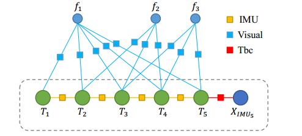
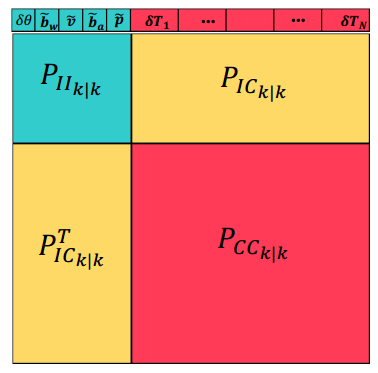
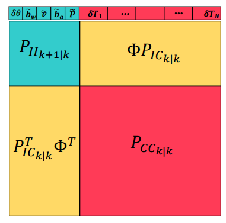
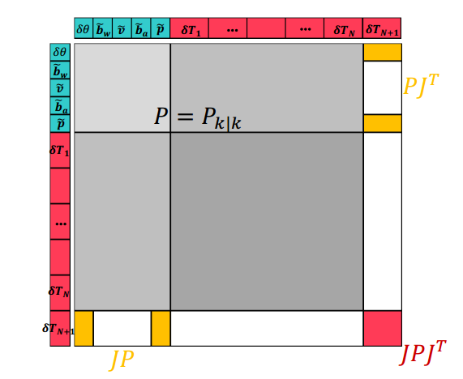
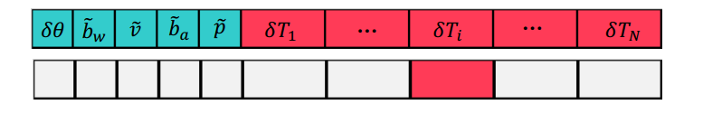
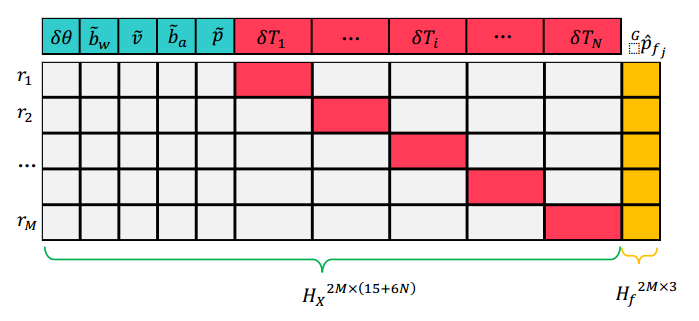
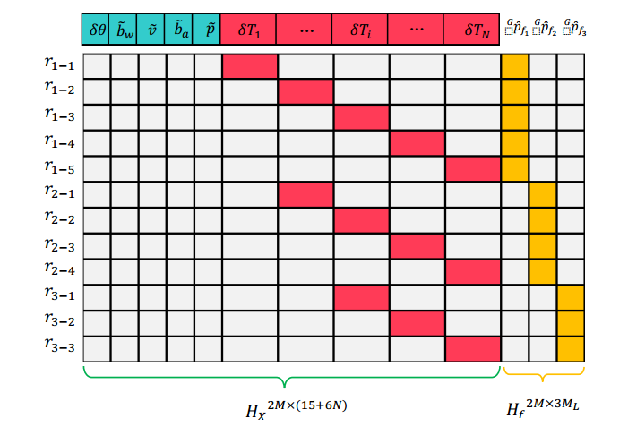

[TOC]

### Tips

Quaternion kinematics for the error-state Kalman filter 中的四元数是Hamilton表示方法,而MSCKF中采用的是JPL表示方法.

# MSCKF(双目)

### 视觉前端

- 获取双目图像,建立图像金字塔,用来作为之后的LK光流跟踪的输入数据.
  - 创建图像金字塔.
- 如果第一帧图像,则第一帧图像是用于初始化,调用initializeFirstFrame()函数进行初始化.
  - 提取FAST关键点.
  - 光流跟踪匹配两帧的关键点.(这个时候算出了IMU的第一帧左右两张图像之间的姿态变换)调用了stereoMatch()函数(这个函数用的是左右两张图像)
    - 计算左图像中的关键点位置矫正.**(矫正后的点是归一化平面坐标下的点)(这里用到了IMU计算的左右两张图像之间的姿态变换作为一个初值)**
    - 然后计算左图像在右图像上的位置**(这个目的是在后面的光流法中给定一个初值)**.
    - 使用LK光流跟踪关键点,输出右图像上的匹配点.
    - 判断跟踪的点是否已经超出图像范围.
    - 然后根据IMU的数据计算第一帧左右两张图像之间的姿态变换关系,计算本质矩阵. 
    - 两帧图像点去畸变.
    - 剔除明显不符合对极几何的点.
  - 保存符合要求的inliers和响应强度.
  - 图像画格子(默认是4x4的格子),分别分配到各个格子中,格子中保存的是检测到的特征点信息(第一帧左右两张图像中的位置以及响应强度)
  - 按照特征点响应对格子中所有特征点进行排序.
  - 按照预设的阈值对每个格子保留特征点
    - 将当前的关键点保存到curr_features_ptr
    - 按照响应值从大到小取指定的特征点.
  - 显示双目图像,并发布消息.
- 如果不是第一帧图像.
  - 调用trackFeatures()函数.**(在trackFeatures()函数中,主要实现特征点的跟踪,过滤误差较大,不稳定的outliers.追踪方法有三种:LK光流跟踪,双目匹配,two-point RANSAC.)**
    - 根据IMU的信息对前后时刻的图像的旋转计算得到一个初值.
      - 找到上一时刻和当前时刻的IMU对应的时间戳.
      - 计算平均角速度.
      - 将平均角速度从IMU系转换到图像坐标系.
      - 通过IMU来计算前后两个时刻两帧图像之间的旋转.
      - 清楚已使用过的IMU信息.
    - 获取前一时刻的双目图像特征的信息.(假如是初始化的第一帧中的图像,则这里面的点就是第一帧左右两张图像所匹配的点)
    - 根据IMU计算得到的旋转值以及单应性原理来预测当前帧的关键帧位置.
      - 通过IMU计算出来的两帧之间的姿态关系计算本质矩阵**(只不过这个本质矩阵没有t,这有两个原因,一个是假设两帧相差时间很短,忽略了深度的差异,公式为$KRK^{-1}$)(所以在无人机这种项目中,因为无人机的速度很快,位移不能忽略,所以应该将t也加入进去)**
      - 然后通过这个本质矩阵计算出Homography矩阵.
      - 通过H矩阵计算出上一帧图像上左图的点在这一帧图像上左图上的位置.**(这个过程中并没有考虑到图像的畸变,所以只是一个粗略的预测)**
    - 通过LK光流对上一时刻的关键点位置做跟踪匹配(这里用到了上一步算出的投影位置作为初值)
    - 过滤在图像外的点,然后就是过滤outlier.(过滤outlier有三步,第一步是双目匹配当前帧的左图和右图,第二步是RANSAC过滤上一帧和当前帧的左图,第三步是RANSAC过滤上一帧和当前帧的右图)
    - 第一步,对当前双目进行匹配,调用stereoMatch()函数,取出outliers.
    - 第二步,对同一个相机的不同时刻做RANSAC剔除外点.
      - 计算两个相机的平均焦距,倒数为一个像素点的归一化坐标值偏差.(因为是双目,所以需要计算平均焦距)
      - 对前后所有的关键点进行去畸变操作.
      - 乘上帧间的旋转使上一时刻与当前时刻的关键点之间只有平移量.
      - 归一化关键点,获得尺度因子,归一化坐标值偏差也需要乘以尺度因子.
      - 计算前后两帧匹配的关键点的差值.
      - 计算关键点差值的平均值,将差值大于阈值的点视为外点剔除.
        - 如果内点数目小于3,则认为所有的输入都是outliers.这种情况发生在速度较大的旋转并且只有很少的feature跟踪到.
      - 检测运动是否退化.(退化表示帧间的平移量几乎为0,这里平均的差值小于1个像素则认为是退化)
      - 接下来就是two-RANSAC方法.
        - 因为$x_2^T\hat{t}Rx_1 = 0$且$x_1'=Rx_1$则推出$x_2^T\hat{t}x_1'=0$
        - 任取前后两帧中的两个匹配关键点,则可以构建一个矩阵方程组$AX=b$
        - 求出$t$,计算各个匹配点的误差,获取inliers.
        - 获得一个内点集,用内点集使用最小二乘的方法计算一个模型,获得内点集的误差总和.
        - 重复上面的过程,选择误差总和最小的内点集.
    - 计算RANSAC后特征点数量.
    - 计算RANSAC的比例.
  - 调用addNewFeatures()函数将新的特征放入当前图像.(如果一直tracking的话,那么随着时间流逝,有些特征会消失,有些可能也会有累计误差,所以我们势必要添加一些新的特征,这个步骤是在跟踪上一帧特征之后要做的,因为stereoMatching()函数和twoPointRansac()函数都会剔除一些outliers,所以我们需要提取新的特征保证能一直运行下去)
    - 建立mask,防止重复检测特征点.(这个mask的范围是特征点的[-2,3]范围内)
    - 检测新的特征点,并将新特征点分配到每个网格,然后按照每个网格特征点的响应排序,使得每个网络特征点的数量不超过网格特征点最大数量限制且不超过本身包含的特征点数量限制.
    - 调用stereoMatch()函数做双目匹配.(获取这一帧左右两张图像中的特征点.)
    - 判断匹配的特征点是不是少于5,或者检测的特征点和匹配的特征点的比例小于0.1.
    - 将新的特征点放入grid里面.
    - 每个grid里面的特征点根据response进行排序.
    - 对每个grid里面进行增加特征点操作,但是增加之后的特征点数量必须小于网格特征点数量最小值.
  - 调用pruneGridFeatures()函数,将grid里面跟踪次数过少的特征点去除.**(首先将curr_features_ptr中每个格子内的特征根据连续跟踪次数排序,如果这个格子内的特征点数目m超过grid_max_feature_num,则去除(m-grid_max_feature_num)个点)**
  - 调用drawFeaturesStereo()函数显示图像结果.
- 将特征点进行去畸变,转化为归一化坐标,调用publish()函数发布了当前特征点的信息.

### MSCKF文件

- 调用initialize()函数.
  - 加载参数.
  - 初始化$Q$矩阵.($Q$矩阵是运动噪声协方差矩阵)
  - 初始化卡方校验表.
  - 创建ROS相关IO.
- 调用imuCallback()函数.
  - 保存IMU数据到$IMU\_msg\_buffer$中.**(这样没有立即传输,可以处理传输延时)**
  - 如果没有重力向量,则初始化重力向量,同时初始化系统第一帧相对重力的变换.**(在系统开始运行后,在一定数量的IMU数据基础上初始化IMU的偏置和初始方向.)(因为s-msckf默认是从静止状态进行初始化的,所以就用加速度平均值初始化重力,角速度平均值初始化角速度偏置)**
    - 累计当前缓存中的IMU角速度和线性加速度.
    - 陀螺仪的偏置为所有初始IMU数据的平均值.
    - 利用加速度平均值初始化重力.**(得到重力向量后构建世界坐标系, 令重力方向为z轴负方向, 然后定义惯性系相对于世界坐标系的朝向)**
    - 然后获得无人机的方向**(在构建了世界坐标系后,便拿世界坐标系z轴和加速度向量计算一个四元数,这个四元数就是无人机的方向)**

- 调用featureCallback()函数
  - 首先判断重力是否已经设置**(如果没有设置的话就不能进入后面的代码)**,再判断是否为第一张图,如果是,将state_server.imu_state.time设置为该图像时间.

  - 调用batchImuProcessing()函数,对当前帧的所有IMU数据进行处理
    - 在for循环中首先对IMU数据进行筛选,选择那些上一次积分时间到当前图像时间的IMU数据.
    - 接着处理每个IMU数据,调用processModel()函数.
    - 在这里面首先让角速度和加速度减去各自的偏置.**(在MSCKF的代码中,角速度偏置在初始化重力的时候就求了出来,而加速度偏置则是直接赋值为0)**,获取当前IMU信息和上一个IMU信息的时间差.

    - 然后就是构建F矩阵和G矩阵.

    - 得到了F,H矩阵后,但是F,H是连续时间下的误差方程,所以我们需要离散化.这个时候我们需要计算出$\Phi$矩阵.$\boldsymbol{\Phi}=\exp \left(\int_{t_{k}}^{t_{k+1}} \mathbf{F}(\tau) d \tau\right)$这里保留其三阶泰勒展开.$\boldsymbol{\Phi} \approx \mathbf{I}+\mathbf{F} d_{t}+\frac{1}{2}\left(\mathbf{F} d_{t}\right)^{2}+\frac{1}{6}\left(\mathbf{F} d_{t}\right)^{3}$

      - 采用四阶龙格库塔方法来使用当前IMU信息估计新的IMU状态.调用了MsckfVio::predictNewState()函数
      - 首先对角速度的四元数进行求导.然后计算角速度的二范数,再乘上时间就是转的角度.$\phi=\|\boldsymbol{\omega}\|_{2} \cdot \Delta t$

        - 接着计算$\phi$对应的四元数为$\mathbf{q}=\left(\begin{array}{c}{\cos (\phi / 2)} \\ {\mathbf{u} \sin (\phi / 2)}\end{array}\right)=\left(\begin{array}{c}{q_{w}} \\ {\mathbf{q}_{v}}\end{array}\right)$.**(这里上下反了,MSCKF使用的是GPL形式的四元素,实部在下,虚部在上.)**然后计算更新后的四元数$\mathbf{q}_{k+1}=\mathbf{q} \otimes \mathbf{q}_{k}$
        $=\left(q_{w} \mathbf{I}+\left(\begin{array}{cc}{-\lfloor\boldsymbol{\omega} \times\rfloor} & {\omega} \\ {-\boldsymbol{\omega}^{T}} & {0}\end{array}\right)\right) \mathbf{q}_{k}=\left(q_{w} \mathbf{I}+\boldsymbol{\Omega}(\boldsymbol{\omega})\right) \mathbf{q}_{k}$这里面的$\omega$是上面的$\mathbf{u}sin(\phi/2)$,在代码中,先算出了角度$\phi$,然后计算出角度的反对称矩阵的归一化矩阵,将归一化矩阵看做是旋转轴$\mathbf{u}$.同时计算出更新$1/2\Delta t$的角度四元数.

      - 然后需要对上一帧的p,v,q进行更新.这里面的q的更新就是之前计算出来的更新后的四元数.**(这个q存的是归一化之后的方向.)v和p的更新是通过四阶龙格库塔方法计算出来的.这里v的更新的四个参数是通过之前算出来的$1/2\Delta t$更新后的角度得出的.**$\begin{aligned} k_{1}^{v} &=\mathbf{q}_{k}^{-1} \otimes \mathbf{a}_{k}+\mathbf{g}^{w} \\ k_{2}^{v} &=d 2 * \mathbf{a}_{k}+\mathbf{g}^{w} \\ k_{3}^{v} &=d 2 * \mathbf{a}_{k}+\mathbf{g}^{w} \\ k_{4}^{v} &=d 1 * \mathbf{a}_{k}+\mathbf{g}^{w} \end{aligned}$

      - 而p的更新则是通过v的更新算出的k值计算出p的k值.

          $k_{1}^{p}=\mathbf{v}_{k}$
          $k_{2}^{p}=\mathbf{v}_{k}+\frac{1}{2} k_{1}^{v} \Delta t$
          $k_{3}^{p}=\mathbf{v}_{k}+\frac{1}{2} k_{2}^{v} \Delta t$
          $k_{4}^{p}=\mathbf{v}_{k}+k_{3}^{v} \Delta t$

      - 然后把上面的系数代入到RK4积分公式中就得到了$\mathbf{v}_{k+1}, \mathbf{p}_{k+1}$,更新state_server.imu_state.

    - 现在开始更新转移矩阵$\Phi$.(在这里的转移矩阵$\Phi$是经过了不可观测性校正的).计算$\Phi$是通过上一次和这一次的$\Phi$的右零空间计算出来的.我们在之前已经算过一次$\Phi$了,这次是对$\Phi$的更新.

      **首先我们需要预测后的角度也就是龙格库塔积分后的IMU状态.(此时状态为$k+1|k$).,这个就是这一次的右零空间值,处于(1,2)的位置.然后,我们需要上一次的右零空间值,如果是第一次的话就是(0,0,0,1),如果不是,则是上一次预测的值.然后可以计算$\Phi_{1,1}(3,3)=q_{k+1|k}*(q_{k|k-1}^T)$.接着我们计算$\Phi_{31}$和$\Phi_{51}$.这两个的计算可以看做是类似$\mathbf{Au=w}$的的矩阵运算,实际上是一个最小化优化问题,可以通过公式$\mathbf{A^*=A-(Au-w)(u^Tu)^{-1}u^T}$计算.**

      - 然后我们计算卡尔曼滤波器的均方误差$\mathbf{P}$.这个均方误差由上次的均方误差和$\Phi$还有离散化噪声协方差计算出来.$\mathbf{Q_k=\Phi GPG^T\Phi^Tdt}$,$\mathbf{P=\Phi P\Phi^T +Ｑ_k}$.
      
        这个时候我们继续更新协方差矩阵，这个矩阵左上角的21×21块是上面计算的均方误差.然后IMU和相机协方差矩阵就是原矩阵乘上$\Phi$.
      
        然后为了对称,协方差矩阵和矩阵转置相加除2.
      
      - 接下来更新右零空间,将这次计算的IMU状态传入右零空间.

  - 接着当图像到来时,需要对误差状态向量进行增广,调用stateAugmentation()函数.

    - 根据IMU和相机的外参以及IMU自身的运动模型可以推断出当前相机的位姿.(这里需要预先获得两个值,一个是相机到IMU的旋转.另一个是IMU到相机的位移.)

    - 对相机状态进行增广后,就要对协方差矩阵进行增广,这里首先要计算增广的相机状态对msckf已有状态的雅克比.

      这里计算的雅克比的计算是根据true-state = nominal-state+error-state这个公式计算出来的.然后我们计算增广后的雅克比矩阵.我们可以发现,当对整体协方差矩阵进行增广后,并不影响原来的整体协方差矩阵$\mathbf{P_{k|k}}$,只是在原来的协方差矩阵的最后新增了6行6列而已.并且,增加的只有与$\delta \theta_{I_{N+1}}$和$\tilde {^Gp_{I_{N+1}}}$有关的两处以及对角线处有值,其他处均为0.

    - 最后,确保协方差矩阵的对称性.

  - 当协方差矩阵增广后,我们需要判断特征点是否为新的特征点并将其加入到地图点中.调用addFeatureObservations()函数.

    - 判断特征点是否为新的特征点,如果是新的特征点,则加入到map中,如果是老的特征点,则跟踪计数器加1.

  - 调用removeLostFeatures()函数,剔除那些不能被三角化并且观测过于少的特征点,同时计算雅克比和残差.

    - 首先判断特征点是否被跟踪,如果被跟踪了,则判断下一个特征点.如果没被跟踪且观测数量小于3,则需要移除这个点.

      如果判断这个特征点观测数量大于3,则要判断这个特征点是否能被初始化.

      - 调用checkMotion()函数,这个函数主要是判断第一次观测到某特征点时的相机位置和最后一次观测到该特征点时的相机位置是否存在一个足够的平移.如果没有足够的平移则需要移除这个点.

      - 调用initializePosition()函数,如果判断checkMotion()返回真,则对特征点位置进行初始化.

        - 算法中把计算特征点的3D坐标构建成了一个最小二乘问题,利用LM算法进行求解.在进行优化之前,首先要得到一个初始估计.

        - 在计算初始估计时,调用generateInitialGuess()函数,取观测到该特征点的第一帧的左相机归一化坐标和观测到该特征点的最后一帧的右相机归一化坐标进行三角化来估计深度,通过足够大的平移来保证一个较高的精度.

        - 接下来就是基于LM算法的非线性优化,优化变量为:$\mathbf{x=(\overline{x} \quad \overline{y} \quad \rho)^T}$,其中$\overline{x}$和$\overline{y}$是特征点的归一化坐标,$\rho$为逆深度.

          假设该特征点在第j帧图像的观测值的诡异化坐标为$\mathbf{m_j}$,第j帧相机位姿相对于第一次观测到该特征点的相机的相对位姿为$\mathbf{R, t}$,则重投影误差为$\mathbf{r=Rp+\rho t - m_j}$.在这里,我们只取$\mathbf{r}$的前两维$\mathbf{r_{2\times1}= (r_x \quad r_y)^T}$.接着就是计算雅克比矩阵$\mathbf{J}$.

          然后根据误差来计算权值,如果误差小于一定值,则权值为1.0,若大于该值,则根据huber核函数计算权值.

          然后基于LM算法构建增量方程$\mathbf{(A+\lambda I)\delta x=b}$.

          如果新的cost比上一次cost小,则将$\lambda$除10,如果比上一次的cost大,则将$\lambda$乘10.

        - 然后也要判断计算出来的特征点的3D位置是否在相机前面,如果不在相机前面,也不能初始化.

    - **判断点能够初始化后,直接计算这个特征点误差$\mathbf{r_i}$对状态向量$\mathbf{X}$雅克比矩阵的行数.行数为$\mathbf{4M-3}$,原因是双目相机每一帧都有两个图片,会提供4行3列的雅克比.如果有M帧观测到了,则会有4M行3列的雅克比.但是,这个测量模型和以前的测量模型不同.以前的测量模型只和状态向量有关,但是这个测量模型还和特征点全局坐标有关.**

      **所以为了解决这个问题,我们会构建一个对特征点全局坐标的雅克比矩阵左零矩阵$\mathbf{A}​$,左乘这个矩阵后,我们就得到了只包含状态向量的测量模型了.但是由于左乘了矩阵A,由于雅克比矩阵的秩为3,所以这个A矩阵的秩为4M-3.所以最后我们获得的关于状态向量的雅克比矩阵为4M-3行3列.**

    - 这个时候对上面不符合要求的特征点进行剔除.

    - 构建雅克比矩阵空间,现在这个雅克比矩阵是由A矩阵左乘状态向量.状态向量的大小为21+6N,N为相机状态的个数,也就是帧数.

    - 然后对跟踪到的特征点进行处理.

      - 调用featureJacobian()函数,计算特征点对所有能观测到该特征点的相机位姿的雅克比和残差.

        每个相机状态会提供4行维度.然后构建观测方程对系统状态的雅克比矩阵,大小为4M×(21+6×N),还有观测方程对特征点全局坐标的雅克比矩阵,大小为4M×3,观测残差,大小为4M×1.

        接着对该特征下的某个相机位姿计算对应的雅克比矩阵.调用measurementJacobion()函数.

        - 首先计算两个相机的位姿,左相机的位姿通过IMU计算得到.右相机的位姿通过两个相机的外参计算得到.

        - 然后将特征点的三维坐标转换到相机坐标系下.然后构建出上面的对状态向量的雅克比矩阵$\mathbf{H_x}$和对特征点全局坐标的雅克比矩阵$\mathbf{H_f}$.

          然后根据可观测性约束构建矩阵计算处新的$\mathbf{H_x}$和$\mathbf{H_f}$,公式形式为$\mathbf{Au=0}$.利用和之前对$\Phi$的更新一样的算法解出结果.

        - 最后一步就是计算残差,用真值减去估计的值.

        这个时候我们就求出了某一个特征对于一个相机状态的雅克比和特征点全局坐标的雅克比,然后当我们求出所有观测的雅克比矩阵后,我们将所有的雅克比矩阵叠起来,构成一个整体的雅克比矩阵.

        接着我们就来解决测量模型包含对特征点全局坐标的雅克比矩阵的问题.我们对$\mathbf{H_f}$进行SVD分解,U矩阵的最后几列就是$\mathbf{H_f}$的左零空间.然后将状态向量雅克比矩阵和残差向量映射到$\mathbf{H_f}$的左零空间中.

        **同时我们也注意到如果我们也注意到,如果我们对于单个双目误差向量关于状态向量的雅克比进行投影,这样的话计算量更小,但是为什么不这样做呢?原因是因为对于单个的误差向量求出来的$\mathbf{H_f}$的左零空间同时也是$\mathbf{H_x}$的左零空间.**

      - 接着调用gatingTest()函数进行卡方检验,判断gamma是否满足条件.如果满足条件则接受该残差和雅克比矩阵.

    - 接着调用measurementUpdate()函数,计算某个特征点对应所有的相机测量的雅克比,并消除$\mathbf{H_f}$.

      - **在把上面某一帧的所有特征点雅克比矩阵叠起来后我们可以看到维数已经变得很大了.假如某一帧观测到了10个特征点,而这10个特征点可以由10帧观测到,那么这个残差的维数为370.**

        **由于$\mathbf{H_x}​$的维数较高,为了降低EKF更新的计算量,所以我们对$\mathbf{H_x}​$进行QR分解.公式为$\mathbf{H_x=[Q_1 \quad Q_2]\left[ \begin{matrix} T_H \\ 0  \end{matrix} \right]}​$.其中$\mathbf{Q_1,Q_2}​$是单位正交列向量组,$\mathbf{T_H}​$为上三角矩阵.**

        **于是我们将$\mathbf{H_x}$代入残差公式$\mathbf{\left(\begin{matrix} Q_1^Tr \\ Q_2^Tr\end{matrix}\right) = \left(\begin{matrix} T_H \\ 0 \end{matrix}\right)\tilde{x} +\left(\begin{matrix} Q_1^Tｎ \\ Q_2^Tｂ\end{matrix}\right)  }$,我们可以看出,通过将残差投影到$\mathbf{T_H}​$的基向量组$\mathbf{Q_1}$上,可以保留观测的全部有效信息,而残差项$\mathbf{Q_2^Tr}$仅仅是噪声,完全可以忽**略.

        于是我们可以通过以下残差来进行EKF更新.$\mathbf{r'=Q_1^Tr=T_H\tilde x +n'}$.接着就是计算卡尔曼增益$\mathbf{K=PT_H^T(T_HPT_H^T+R)^{-1}}$,于是状态向量的修正增量为$\mathbf{\Delta x=Kr}$.最后更新协方差$\mathbf{P_{k+1|k+1}=(I_\xi-KT_H)P_{k+1|k}(I_{\xi}-KT_H)^T+KRK^T}$.这里的$\mathbf{R}$是一个常数,为特征点观测噪声.

      - 当我们计算出状态向量的修正增量后,我们需要更新IMU的状态.更新相机与IMU之间的外参数.

      - 更新状态向量中每个相机的状态.

  - 调用pruneCamStateBuffer()函数,准备进行update().**update的时机有两个,一个是失去feature的时候,也就是丢失的feature但是观测超过3个值,还有一个就是slideWindow满了的时候.**

    - 判断slideWindow是否已经满了.没满就退出这个函数.

    - 如果没满则调用findRedundantCamStates()函数.这个函数是查找冗余相机位姿,冗余相机位姿为与关键相机位姿(在代码中关键相机位姿为倒数第四个位姿)相差小的位姿或者相机状态向量中靠前的位姿.

      查找的冗余关键帧是从关键相机位姿的前一帧开始的,如果这一帧不是冗余关键帧,则把最新加入的帧视为冗余关键帧.总共删除两帧.

    - 在找到两个冗余关键帧后,遍历这两个位姿产生共视的所有特征点构建特征雅克比矩阵,删除冗余相机位姿的观测,对于这些共视点和两个相机位姿进行EKF更新.(如果特征点不能初始化,那么只需在相机状态中删除这个特征点即可)(计算雅克比和更新步骤和上面的一样,西安调用featureJacobian()函数再调用measurementUpdate()函数)

    - 最后在状态协方差矩阵中移除相应的行和列.

  

### 公式推导

$I$:IMU机体坐标系

$G$:惯性坐标系

$C$:相机坐标系

作为一个滤波器,滤波器的状态向量有两个部分,分别为IMU状态和Camera状态,
$$
\mathbf{x}_I=[^I_G\mathbf{q}^T\ \mathbf{b}_g^T\ ^{G} \mathbf{v}_{I}^{T}\ \mathbf{b}_{a}^{T} \ ^{G} \mathbf{p}_{I}^{T}\ _{C}^{I} \mathbf{q}^{T} \ ^I{\mathbf{p}_{C}^{T}}]^T
$$
$^{I}_{G} \mathbf{q}$表示的是从惯性系到机体IMU的旋转变换,$^{G} \mathbf{v}_{I}$和$^{G} \mathbf{p}_{I}$分别表示机体在惯性系下的速度和位置,$^{I}_{C} \mathbf{q}$和$^{I} \mathbf{p}_{C}$分别代表从相机坐标系到IMU坐标系的旋转和平移,以左相机为准.

误差状态为,

$$
\tilde{\mathbf{x}}_I=[^I_G\tilde{\mathbf{\theta}}^T\ \tilde{\mathbf{b}}_g^T\ ^{G} \tilde{\mathbf{v}}^{T}\ \tilde{\mathbf{b}}_{a}^{T} \ ^{G} \tilde{\mathbf{p}}_{I}^{T}\ _{C}^{I} \tilde{\mathbf{\theta}}^{T} \ ^I{\tilde{\mathbf{p}}_{C}^{T}}]^T
$$
对于普通的变量,满足通用的加减关系,但是对于四元数来说,误差四元数为
$$
\delta \mathbf{q}=\mathbf{q} \otimes \hat{\mathbf{q}}^{-1} \approx (\frac{1}{2} {_{I}^{G}\tilde{\boldsymbol{\theta}}^{T}} \ 1)^T
$$
其中$_{I}^{G} \tilde{\boldsymbol{\theta}}^{T} \in \mathbb{R}^{3}$表示一个微小的旋转,通过这种方式将旋转误差降到了三维.考虑到最终的误差状态向量,设有N个相机状态,则最终的误差状态向量为
$$
\tilde{\mathbf{x}}=\left(\begin{array}{cccc}{\tilde{\mathbf{x}}_{I}^{T}} & {\tilde{\mathbf{x}}_{C_{1}}} & {\dots} & {\tilde{\mathbf{x}}_{C_{N}} )^{T}}\end{array}\right.
$$

$$
\tilde{\mathbf{x}}_{C_{i}}=\left(\begin{array}{cc}{^{C_{i}}_{G}}  {\tilde{\boldsymbol{\theta}}^{T}} & ^{G}  {\tilde{\mathbf{p}}_{C_{i}}^{T}}\end{array}\right)^{T}
$$

以下图为例,状态向量包含5个相机的位姿$T_{1\sim5}$和当前时刻的位姿$X_{I M U_{5}}$,其中$X_{I M U_{5}}$和$T_5$均表示当前时刻的状态,只不过局部坐标系不同,一个是IMU系,一个是Camera系,两者通过图中红色方块的外参进行约束.另外,黄色小块为IMU预测因子,蓝色小块为视觉更新因子.值得注意的是,**图中的路标点$f_{1\sim3}$未放入到优化变量中,而是通过足够多的**
**KF对路标点进行三角化,并相信三角化的结果是准确的,从而将其固定住并边缘化掉,将边缘化后的影响作为先验约束加入到滑窗内的共视相机位姿上,再进行视觉更新.**

下图会用$f_1$和$f_2$这两个路标点进行视觉更新,$f_1$是因为太老,被滑窗所有帧都看见;$f_2$是不被当前帧$T_5$所观测到了,$f_3$因为还能被当前帧观测到,且不算太老,所以留在窗口中继续跟踪.

优化变量的数学形式为
$$
X_{k}^{(16+7 N)} \times 1=[X_{IMU_k}\  {^{C_1}_G\overline{q}} \ {^Gp_{C_1}} \ ... \ {^{C_N}_G\overline{q}} \ {^Gp_{C_N}}]
$$
其中,$^{C_{1}}_G \overline{q}=\overline{q}_{C_{1} \leftarrow G}$为归一化四元数,$^{G} p_{C_{1}}=p_{G \leftarrow C_{1}}$注意旋转和平移的坐标系方向相反,第k帧的优化变量$X_{IMU_{k}}$为,
$$
X_{I M U_{k}}^{16 \times 1}=\left[\begin{array}{lll}^{I}_G {\overline{q}} & {b_{g}} & {^{G} v_{I}} & {b_{a}} & {p_{I}}\end{array}\right]^{T}
$$

$$
T_{i}^{7 \times 1}=\left[\begin{array}{ll}^{C_i}_G {\overline{q}} & {^{G} p_{C_{i}}}\end{array}\right]^{T}
$$

严格来说,优化变量矩阵中的各元素右上角也应加上转置符号"T",即优化变量为多行一列排布,这里为了形式上简单,不严禁地省去了转置符号,仅在整体矩阵外面加上转置.

MSCKF在预测和更新时的处理对象为误差状态向量,并非上面的实际状态向量,理由有以下四个:

- 朝向用四元数表示是过参的,但是角度误差的参数只有3个,与自由度是一致的.
- 误差的均值为0,更接近初值,线性化点较为准确.
- 误差的值很小,可忽略二阶.
- 误差的运动很慢.

那么,对应的误差状态向量为
$$
\tilde{X}_{k}^{(15+6 N)} \times 1=[\tilde{X}_{IMU_k}\  {{\delta\theta}_{C_1}} \ {^G\tilde{p}_{C_1}} \ ... \ {\delta\theta}_{C_N} \ {^G\tilde{p}_{C_N}}]
$$
其中,$\delta \theta_{C_{1}}=\delta \theta_{C_{1} \leftarrow G}$,$^{G} \tilde{p}_{C_{1}}=\tilde{p}_{G \leftarrow C_{1}}$,第k帧的误差状态向量$\tilde{X}_{IMU_k}$为
$$
X_{I M U_{k}}^{15 \times 1}=\left[\begin{array}{lll}{\delta{\theta}_I} & {\tilde{b}_{g}} & {^{G} \tilde{v}_{I}} & {\tilde{b}_{a}} & {^G\tilde{p}_{I}}\end{array}\right]^{T}
$$
其中,$\delta \theta_{I}=\delta \theta_{I \leftarrow G}$表示从世界系到IMU局部系的旋转角度.

#### 离散状态下的误差状态的运动方程

在连续形式下,误差状态的运动方程为
$$
\dot{\tilde{X}}_{I M U}^{15 \times 1}=F^{15 \times 15} \tilde{X}_{I M U}^{15 \times 1}+G^{15 \times 12} n_{I M U}^{12 \times 1}
$$
那么离散状态下的误差导数公式为
$$
\tilde{X}_{I M U_{k+1}}=\Phi\left(t_{k}+\Delta T, t_{k}\right) \tilde{X}_{I M U_{k}}+(G \Delta T) n_{I M U}
$$
其中,$\Delta T$为第k个IMU时刻到第k+1个IMU时刻的间隔,$\Phi$为第k时刻的IMU误差项到第k+1时刻的变换关系,有些文献将$\Phi$写成指数形式,还有写文献写成近似形式:
$$
\Phi\left(t_{k}+\Delta T, t_{k}\right)=\exp (F \Delta T) \cong \mathrm{I}_{15 \times 15}+F \Delta T
$$
但mskckf与上面不同.

#### 连续形式下的协方差传播

假如第k时刻的整体的协方差矩阵如下:
$$
P_{k | k}^{(15+6 N) \times(15+6 N)}=\left[\begin{array}{cc}{P_{I I_{k | k}}} & {P_{I C_{k | k}}} \\ {P_{I C_{k | k}}^{T}} & {P_{C C_{k | k}}}\end{array}\right]
$$
其中,$P_{k | k}^{(15+6 N) \times(15+6 N)}$是当前帧的PVQB与自身的协方差矩阵;$P_{I C_{k | k}} 15 \times 6 N$为当前帧的PVQB与滑窗内其他帧位姿的协方差矩阵;$P_{C C_{k | k}} 6 N \times 6 N$为滑窗内所有相机的位姿与自身的协方差矩阵.

下图给出了整体IDE误差状态向量,以及整体的协方差矩阵.

当下一个IMU,即第k+1个IMU来到后,此时k+1时刻的整体协方差矩阵可写为:
$$
P_{k+1 | k}^{(15+6 N) \times(15+6 N)}=\left[\begin{array}{cc}{P_{I I_{k+1 | k}}} & {\Phi\left(t_{k}+\Delta T, t_{k}\right) P_{I C_{k | k}}} \\ {P_{I C_{k | k}}^{T} \Phi\left(t_{k}+\Delta T, t_{k}\right)^{T}} & {P_{C C_{k | k}}}\end{array}\right]
$$
第k+1时刻的整体协方差矩阵可用下图表示:

计算$P_{I I_{k+1 | k}}$:
$$
P_{I I_{k+1 | k}}=\Phi P_{I I_{k | k}} \Phi^{T}+G Q_{I M U} G^{T} \Delta T
$$
第k+1时刻的IMU和Camera位姿的协方差计算公式为:
$$
P_{I C_{k+1 | k}}=\Phi\left(t_{k}+\Delta T, t_{k}\right) P_{I C_{k | k}}
$$
上面的公式可以理解为:
$$
\mathrm{P}\left(I_{k+1} | C_{k}\right)=P\left(I_{k+1} | I_{k}\right) \mathrm{P}\left(I_{k} | C_{k}\right)
$$

#### 误差状态向量增广

当我们获得一张新的相机图像时,假设为N+1帧图像,则需要将位姿的误差加入到当前优化状态向量中,首先我们给出第N+1帧图像的位姿.

无误差和噪声的相机位姿可以写成如下形式:
$$
\widehat{T}_{C_{N+1} \leftarrow G}^{7 \times 1}=\left[\begin{array}{c}{^{C_{N+1}}_G \hat{\overline{q}}} \\ {^G{\hat{p}_{C_{N+1}}}}\end{array}\right]=\left[\begin{array} c{^{C}_{I} \hat{\overline{q}}} \otimes {_G^{I_{N+1}} \hat{q}}  \\ ^{G} \hat{p}_{I_{N+1}}+^{I_{N+1}}_G \widehat{\overline{q}}^{T} {^I{p_{C}}}\end{array}\right]
$$
 然后我们想要获取带误差和噪声的真实相机位姿,则要在上面的公式基础上加上error,可得:
$$
T_{C_{N+1} \leftarrow G}^{7 \times 1}=\delta T_{C_{N+1} \leftarrow G} \oplus \hat{T}_{C_{N+1} \leftarrow G} = \left[\begin{array}{c}{\exp \left(\delta \theta_{C_{N+1} \leftarrow G}^{\wedge}\right)_{G}^{C_{N+1}} \widehat{\overline{q}}} \\ ^G{\hat{p}_{C_{N+1}}+^{G} \tilde{p}_{C_{N+1}}}\end{array}\right]
$$
将无误差噪声相机位姿的公式代入可得:
$$
T_{C_{N+1} \leftarrow G}^{7 \times 1}=\left[\begin{array}c{^C_I \overline{q}}\otimes exp{(\delta \theta_{I_{N+1} \leftarrow G}^{\wedge}})\ ^{I_{N+1}}_G \hat{\overline{q}} \\
\left(^{G} \hat{p}_{I_{N+1}}+^{G} \tilde{p}_{I_{N+1}}\right)+\left[\exp \left(\delta \theta_{I_{N+1}\leftarrow G}^{\wedge}\right)_{G}^{I_{N+1}} \hat{\overline{q}}\right]^{T} {^{I} p_{\mathcal{C}}}
\end{array}\right]
$$
因为MSCKF中讨论的状态向量为状态向量的误差,因此**增广的误差状态向量为当前帧即第N+1帧的位姿误差**.(**我们用来计算的是当前帧的PVBQ误差和滑窗内其他老帧的位姿误差**)那么,需要增广的位姿误差可写为:
$$
\delta T_{C_{N+1} \leftarrow G}=\left[\begin{array}{c}{\delta \theta_{C_{N+1} \leftarrow G}} \\ {^G \tilde{p}_{C_{N+1}}}\end{array}\right]
$$

那么,根据上面公式,我们可以推导出第N+1帧相机位姿的误差状态向量和原来的整体误差状态向量的关系,即将公式中的每一行单独写开为:
$$
{\exp \left(\delta \theta_{C_{N+1} \leftarrow G}^{\wedge}\right)_{G}^{C_{N+1}} \widehat{\overline{q}}} ={^C_I \overline{q}}\otimes exp{(\delta \theta_{I_{N+1} \leftarrow G}^{\wedge}})\ ^{I_{N+1}}_G \hat{\overline{q}} \Leftrightarrow \delta \theta_{C_{N+1} \leftarrow G}=_{I}^{C} \overline{q} \delta \theta_{I_{N+1} \leftarrow G}
$$

$$
^G{\hat{p}_{C_{N+1}}+^{G} \tilde{p}_{C_{N+1}}} =\left(^{G} \hat{p}_{I_{N+1}}+^{G} \tilde{p}_{I_{N+1}}\right)+\left[\exp \left(\delta \theta_{I_{N+1}\leftarrow G}^{\wedge}\right)_{G}^{I_{N+1}} \hat{\overline{q}}\right]^{T} {^{I} p_{\mathcal{C}}}  \\
\Leftrightarrow ^{G} \tilde{p}_{C_{N+1}}=^{G} \tilde{p}_{I_{N+1}}+^{I_{N+1}}_{G} \hat{q}^{T}\left(^{I} p_{C}\right)^{\wedge} \delta \theta_{I_{N+1} \leftarrow G}
$$

#### 协方差矩阵的增广

当来一帧新图像后,新的协方差矩阵可写成:
$$
P_{k | k} \leftarrow \frac{\partial \delta T_{C_{N+1} \leftarrow G}}{\partial \overline{X}} \cdot P_{k | k} \cdot \frac{\partial \delta T_{C_{N+1}\leftarrow G}^{T}}{\partial \tilde{X}}
$$
即:
$$
\begin{aligned} P_{k | k}^{(15+6(N+1)) \times(15+6(N+1))} & \leftarrow\left[\begin{array}{c}{I_{6 N+15}} \\ {J}\end{array}\right] P_{k | k}^{(15+6 N) \times(15+6 N)}\left[\begin{array}{c}{I_{6 N+15}} \\ {J}\end{array}\right]^{T} \\=\left[\begin{array}{cc}{P_{k | k}} & {P J^{T}} \\ {J P} & {J P J^{T}}\end{array}\right] \end{aligned}
$$

其中,
$$
J^{6 \times(15+6 N)}=\frac{\partial \delta T_{C_{N+1}+G}}{\partial \tilde{X}}=\left[\begin{array}{ccc}{\frac{\partial \delta \theta_{C_{N+1}}}{\partial \delta \theta_{I_{N+1}}}} & {0_{3 \times 9}} & {\frac{\partial \delta \theta_{C_{N+1}}}{\partial^{G} \tilde{p}_{I_{N+1}}}} & {0_{3 \times 6 N}} \\ {\frac{\partial^{G} \tilde{p}_{C_{N+1}}}{\partial \delta \theta_{I_{N+1}}}} & {0_{3 \times 9}} & {\frac{\partial^{G} \tilde{p}_{C_{N+1}}}{\partial^{G} \tilde{p}_{I_{N+1}}}} & {0_{3 \times 6 N}}\end{array}\right] \\
=\begin{array}{cccc}{\left[\begin{array}{c}{C(_{I}^{C} \overline{q} )} & {0_{3 \times 9}} & {0_{3 \times 3}} & {0_{3 \times 6 N}} \\ {C_{\hat{q}}^{T}\left(^{I} p_{C}\right)^{\wedge}} & {0_{3 \times 9}} & {I_{3 \times 3}} & {0_{3 \times 6 N}}\end{array}\right]}\end{array}
$$

所以由上面分析可知,当新来一帧图像后,对整体协方差矩阵进行增广,并不影响原有的整体协方差矩阵,只是在原来的协方差矩阵后新增6行6列.并且增加的行列中只有与$\delta \theta_{I_{N+1}}$和$^G\tilde{p}_{I_{N+1}}$有关的两处及对角线处有值,其他处均为0.

#### 视觉测量模型

对于第$j$个路标点,它在第$i$个相机中所观测到的重投影误差为:
$$
r^{2 \times 1}=P_{c}-\hat{P}_{c}
$$
其中,$P_c$为该路标点被第$i$个相机实际观测到的,在归一化相机系下的坐标值,可根据CCD像素平面的坐标值推导可得:
$$
P_{c}=\left[\begin{array}{l}{\frac{x}{z}} \\ {\frac{y}{z}}\end{array}\right]+n=\left[\begin{array}{c}{\frac{u-c_{x}}{f_{x}}} \\ {\frac{v-c_{y}}{f_{y}}}\end{array}\right]+n
$$
其中,$n$为在归一化坐标系下的视觉测量误差,可根据标定的像素误差计算在归一化坐标系下的值来得到.

而$\hat{P}_{c}$为计算得到的在归一化相机系下的坐标值,
$$
\hat{P}_{c}=\left[\begin{array}{l}{\frac{\hat{x}}{\hat{z}}} \\ {\frac{\hat{y}}{\hat{z}}}\end{array}\right]
$$
其中,路标点在相机系下的坐标值可以通过下式获得(**用世界坐标系下的路标点坐标减去世界坐标系的光心坐标,再左乘一个世界到相机的旋转矩阵**)
$$
\hat{P}_{c}^{\prime}=\left[\begin{array}{l}{\widehat{x}} \\ {\hat{y}} \\ {\hat{z}}\end{array}\right]=C\left(\begin{array}{c}{^{C_{i}} _{G}\hat{\overline q}} \end{array}\right)\left(\begin{array}{c}{^{G} \hat{p}_{f_{j}}-^{G} \hat{p}_{c_{i}} )}\end{array}\right.
$$

#### 视觉雅克比计算

下面我们来计算$r$相对于当前时刻下的整体误差状态向量$\tilde{X}$和第$j$个路标点在世界坐标系下的坐标$P_{w}=^{G} \hat{p}_{f_{j}}$来分别求雅克比.

根据常见的高斯牛顿思路,可将误差在线性化点处进行展开,$e(x+\delta x) \approx e(x)+\frac{\partial e}{\partial x} \delta x$.

对于我们这里讨论的误差状态向量,其线性化点在0处,即误差的状态分布为均值为0的高斯分布.那么,重投影误差可近似展开为如下形式,
$$
r^{2 \times 1} \cong H_{X}^{2 \times(15+6 N)} \tilde{X}^{(15+6 N) \times 1}+H_{f_{j}}^{2 \times 3} \hat{p}_{f_{j}}^{3 \times 1}+n^{2 \times 1}
$$
其中,$n_i$的协方差矩阵为$R=\sigma_{i m g}^{2} I_{2}$.

根据链式法则,可计算出关于整体误差状态向量$\tilde X$的雅克比
$$
H_{X} = \frac{\partial r}{\partial \tilde{X}}=\frac{\partial r}{\partial P_{c}^{\prime}} \frac{\partial P_{c}^{\prime}}{\partial \tilde{X}}\\
=[0_{2 \times 15} \quad 0_{2 \times 6} \cdots J_{P_{c}^{\prime}}\left[R_{C\leftarrow G}\left(t_{G\leftarrow C}-P_{G}\right)\right]^{\Lambda}-J_{P_{c}^{\prime}} R_{C\leftarrow G}]
$$
上面关于误差状态向量的雅克比可以用下图形象表示,只有观测到该路标点的第$i$个相机位姿处(图中红色块)有值,其他处均为0

另外,根据链式法则,同样计算出关于路标点$^{G} \hat{p}_{f_{j}}$的雅克比
$$
H_{f_{j}}=\frac{\partial r}{\partial^{G} \hat{p}_{f_{j}}}=\frac{\partial r}{\partial P_{c}^{\prime}} \frac{\partial P_{c}^{\prime}}{\partial^{G} \hat{p}_{f_{j}}}=J_{P_{c}^{\prime}} \times R_{C+G}
$$
其中,$J_{P_{c}^{\prime}}$为重投影误差相对于相机系下坐标$P_{c}^{\prime}$的雅克比
$$
J_{P_{C}^{\prime}}=\frac{\partial r}{\partial P_{c}^{\prime}}=\frac{1}{\hat{z}}\left[\begin{array}{ccc}{1} & {0} & {-\frac{x}{\hat z}} \\ {0} & {1} & {-\frac{y}{\hat z}}\end{array}\right]
$$
我们将对该路标点的所有Camera观测汇总可得(设该路标点被M个Camera观测到)
$$
r^{2 M \times 1} \cong H_{X}^{2 M \times(15+6 N)} \tilde{X}^{(15+6 N) \times 1}+H_{f}^{2 M \times 3} G_{\hat{p}_{f}}^{3 \times 1}+n^{2 M \times 1}
$$
上式中与该路标点有关的所有视觉约束银子关于观测到的相机位姿的整体雅克比$H_{X}^{2 M \times(15+6 N)}$可表示为下图

,每行表示一个相机观测到第j个路标点产生的视觉误差关于整体误差状态向量的雅克比,可见每行只有观测到路标点的相机位姿处有值,其他处均为0,最后的黄色列表示视觉误差关于路标点的世界坐标$^{G} \hat{p}_{f_{j}}$的雅克比

下面给出当最新帧有多个路标点看不见时,对应的所有路标点的重投影误差对整体误差状态向量和相应路标点坐标值的雅克比

#### 视觉雅克比处理

对于EKF,残差线性化要满足以下形式,即**残差仅与一组状态向量的误差项成线性化关系,且噪声项为与状态向量无关的零均值的高斯分布**,即残差应能简化为这种形式:$r \cong H \delta x+n$.

**而MSCKF的残差与两个状态向量的误差项相关,不满足上式的线性化形式,所以不能直接用EKF的测量更新流程.**

为了克服这个问题,我们将原来的残差$r^{2 M \times 1}$投影到$H_{f}^{2 M \times 3 M_{L}}$的左零空间中(左零空间大小为$M \times\left(2 M-3 M_{L}\right)$),并令投影后的残差为$r_{0}^{\left(2 M-3 M_{L}\right) \times 1}$.令矩阵A为半正交矩阵(即$\mathrm{A}^{T} A=I$),A的列组成了$H_f$的左零空间,可得
$$
\begin{array}{c}{r_{0}^{\left(2 M-3 M_{L}\right) \times 1}=A^{T} r^{2 M \times 1} \cong \underbrace{A^{T} H_{X}^{2 M \times(15+6 N)}}_{H_{0}} \tilde{X}^{(15+6 N) \times 1}+\underbrace{A^{T} n^{2 M \times 1}}_{n_{0}}} \\ {=H_{0}^{(2 M-3M_{L}) \times(15+6 N)} \tilde{X}^{(15+6 N) \times 1}+n_{0}^{(2 M-3M_{L}) \times 1}}\end{array}
$$
其中,$\mathrm{A}^{2 M \times(2 M-3M_{L})}$.

#### 视觉更新

当某个路标点不见或者太老时,即因为遮挡或视野等问题不能被当前帧所观测到,或者该路标点被观测到的共视帧数量大于某个阈值时进行EKF更新过程.因为通常$H_0$的矩阵很大,为了降低计算量,我们对$H_0$进行QR分解.
$$
H_{0}^{(2 M-3M_{L}) \times(15+6 N)}=\left[\begin{array}{ll}{Q_{1}} & {Q_{2}}\end{array}\right]\left[\begin{array}{c}{T_{H}} \\ {0}\end{array}\right]
$$
其中,$Q_{1}^{(2 M-3M_L) \times(15+6 N)}, Q_{2}^{(2 M-3M_L) \times(15+6 N)}$为正交矩阵,$T_{H}(15+6 N) \times(15+6 N)$为上三角矩阵.

那么视觉误差公式可以化为
$$
\left[\begin{array}{l}{Q_{1}^{T} r_{0}} \\ {Q_{2}^{T} r_{0}}\end{array}\right]=\left[\begin{array}{c}{T_{H}} \\ {0}\end{array}\right] \tilde{X}+\left[\begin{array}{l}{Q_{1}^{T} n_{0}} \\ {Q_{2}^{T} n_{0}}\end{array}\right]
$$
如果我们忽略仅为噪声项的$Q_{2}^{T} r_{0}$,那么可得最后的观测方程
$$
\begin{aligned} Q_{1}^{T} r_{0} &=T_{H} \tilde{X}+Q_{1}^{T} n_{0} \\ \Rightarrow r_{n}^{(15+6 N) \times 1} &=T_{H} \tilde{X}+n_{n} \end{aligned}
$$
其中,$n_n$的协方差矩阵为$R_{n}=Q_{1}^{T} R_{0} Q_{1}=\sigma_{i m}^{2} I_{r}$.

最后,我们应用EKF的更新公式,可得卡尔曼增益为
$$
K=P T_{H}^{T}\left(T_{H} P T_{H}^{T}+R_{n}\right)^{-1}
$$
则误差状态向量的增量可求解为
$$
\Delta X=K r_{n}
$$
协方差矩阵为
$$
P_{k+1 | k+1}=\left(I_{\xi}-K T_{H}\right) P_{k+1 | k}\left(I_{\xi}-K T_{H}\right)^{T}+K R_{n} K^{T}
$$

### 附录

#### 龙格库塔方法

对于**一阶精度**的欧拉公式有:
$$
y_{i+1}=y_{i}+h k_{i}
$$
其中,$h$为步长,则$y_{i+1}$的表达式与$y(x_{i+1})$的Taylor展开式的前两项完全相同,则局部截断误差为$O\left(h^{2}\right)$.

如果我们想获得**二阶精度**的改进欧拉公式,则我们需要用点$x_i$处的斜率近似值$k_1$与右端点$x_{i+1}$处的斜率$k_2$的算术平均值作为平均斜率$k^*$的近似值,公式如下:
$$
y_{i+1}=y_{i}+h\left(k_{1}+k_{2}\right)
$$
其中,$k_1=f(x_i,y_i), k_2=f(x_i+h,y_i+hk_1)$

于是我们能够考虑用函数$f(x,y)$在若干点上的函数值的线性组合构造近似公式.我们要求构造的近似公式在$f_(x_i, y_i)$处的Taylor展开式与解$y(x)$在$x_i$处的Taylor展开式前面几项重合,从而使近似公式达到所需要的阶数.这样既避免求高阶导数,又提高了计算方法精度的阶数.或者说,在$[x_i,x_{i+1}]$这一步内计算多个点的斜率值,若将其进行加权平均作为平均斜率,则可以构造处更高精度的计算公式,这就是龙格库塔方法.

下面介绍**四阶龙格库塔**方法:

设
$$
y_{i+1}=y_{i}+c_{1} K_{1}+c_{2} K_{2}+c_{3} K_{3}+c_{4} K_{4}
$$
这里的$K_1,K_2,K_3,K_4$是四个不同点上的函数值,分别设其为:
$$
\begin{array}{l}{K_{1}=h f\left(x_{i}, y_{i}\right)} \\ {K_{2}=h f\left(x_{i}+a_{2} h, y_{i}+b_{21} K_{1}\right)} \\ {K_{3}=h f\left(x_{i}+a_{3} h, y_{i}+b_{31} K_{1}+b_{32} K_{2}\right)} \\ {K_{4}=h f\left(x_{i}+a_{4} h, y_{i}+b_{41} K_{1}+b_{42} K_{2}+b_{43} K_{3}\right)}\end{array}
$$
其中$c_i,a_i,b_{ij}$均为待定系数.

经过一系列的求解过程就能得到系数的一组特解:
$$
\begin{array}{c}{a_{2}=a_{3}=b_{21}=b_{32}=\frac{1}{2}} \\ {b_{31}=b_{41}=b_{42}=0} \\ {a_{4}=b_{43}=1} \\ {c_{1}=c_{4}=\frac{1}{6}} \\ {c_{2}=c_{3}=\frac{1}{3}}\end{array}
$$
代入之后得到:
$$
\begin{array}{l}{y_{i+1}=y_{i}+\frac{1}{6}\left(K_{1}+2 K_{2}+2 K_{3}+K_{4}\right)} \\ {K_{1}=h f\left(x_{i}, y_{i}\right)} \\ {K_{2}=h f\left(x_{i}+\frac{h}{2}, y_{i}+\frac{1}{2} K_{1}\right)} \\ {K_{3}=h f\left(x_{i}+\frac{h}{2}, y_{i}+\frac{1}{2} K_{2}\right)} \\ {K_{4}=h f\left(x_{i}+h, y_{i}+K_{3}\right)}\end{array}
$$
龙格库塔方法的推导基于Taylor展开方法,因此它要求所求的解具有较好的光滑性.如果解的光滑性差,那么使用四阶龙格库塔方法求解的数值解,其精度可能反而不如改进的欧拉方法.所以对于光滑性不太好的解,最好采用低阶算法并且将步长$h$取小.